# ShramSetu — Technical System Design Specification

> **Document status:** v1.0 — Production-ready baseline
> **Owner:** Platform Architecture
> **Scope:** Native mobile apps (Android + iOS), ReactJS web app, Python backend services
> **Audience:** Engineering, SRE, Security, Product, Data

---

## Table of Contents

1. [System Overview & Requirements](#1-system-overview--requirements)
2. [High-Level Design (HLD)](#2-high-level-design-hld)
3. [Workflow & Process Flow](#3-workflow--process-flow)
4. [Low-Level Design (LLD) & Component Interactions](#4-low-level-design-lld--component-interactions)
5. [Data Models & Storage Strategy](#5-data-models--storage-strategy)
6. [Resilience, Security & Trade-offs](#6-resilience-security--trade-offs)

---

# 1. SYSTEM OVERVIEW & REQUIREMENTS

## 1.1 High-Level Objective

**ShramSetu** ("labour bridge") is a two-sided, trust-first marketplace that connects India's
informal, blue-collar and grey-collar workforce — construction labourers, drivers, delivery
riders, factory operators, housekeeping staff, security guards, electricians, plumbers, cooks —
with verified employers, contractors and staffing agencies.

The platform closes four structural gaps in the informal labour market:

| Gap | Today | ShramSetu |
|-----|-------|-----------|
| **Discovery** | Word-of-mouth, labour chowks, middlemen taking 15–30% | Geo + skill matching, zero worker-side fee |
| **Trust** | No verifiable identity, no work history | eKYC-backed identity + portable, tamper-evident work record |
| **Payment** | Cash, delayed 30–60 days, wage theft | Escrowed digital wages, T+1 UPI settlement, auditable ledger |
| **Mobility** | Skills invisible across employers | Skill passport, assessments, NSQF-aligned certifications |

### Business Context

- **Market**: ~450M informal workers in India; ~90% of the workforce.
- **Constraints**: Low-end Android devices (2GB RAM, Android 8+), intermittent 2G/3G,
  ~35% of target users are low-literacy, 12+ languages, ₹ per-MB data sensitivity.
- **Monetisation**: Employer subscription + per-hire success fee + payroll float + value-added
  services (background verification, insurance, skilling). **Workers never pay.**
- **Regulatory**: DPDP Act 2023, Code on Wages 2019, RBI payment-aggregator guidelines,
  e-Shram interoperability, ESIC/EPFO reporting for formal placements.

### Personas & Surfaces

| Persona | Primary Surface | Key Characteristics |
|---------|-----------------|---------------------|
| **Worker** | Android app (React Native), low-end device | Voice-first, icon-heavy, offline-tolerant, vernacular |
| **Employer / Site Supervisor** | Android + iOS app | On-site attendance marking, shift ops, approvals |
| **Employer HR / Contractor** | React web console | Bulk posting, workforce planning, payroll, invoices |
| **Staffing Agency** | React web console + API | Roster management, deployment, multi-client billing |
| **Ops / Trust & Safety** | React internal console | Verification queues, disputes, fraud review |
| **Government / Partner** | Read-only API + reports | Aggregate workforce analytics, e-Shram linkage |

---

## 1.2 Functional Requirements

Requirements are grouped by the **13 bounded contexts (modules)** that structure the entire
codebase, deployment topology and this document.

### FR-1 · Identity & Access Module (IAM)
- **FR-1.1** Phone-number-first registration via OTP (SMS + WhatsApp + voice-OTP fallback).
- **FR-1.2** Aadhaar-based eKYC via DigiLocker / offline XML / OTP-based UIDAI flow.
  Only the **last-4 digits + a hashed reference token** are persisted; never the full Aadhaar.
- **FR-1.3** Employer KYB: GSTIN, CIN, PAN, Udyam registration verification.
- **FR-1.4** Multi-tenant RBAC + ABAC: roles (`worker`, `supervisor`, `hr_admin`,
  `agency_admin`, `ops`, `finance`, `superadmin`) scoped by `org_id` and `site_id`.
- **FR-1.5** Device binding, session management, refresh-token rotation, remote logout.
- **FR-1.6** Account recovery when a worker loses the SIM (assisted, ops-verified flow).

### FR-2 · Worker Profile & Skill Passport Module
- **FR-2.1** Guided, voice-assisted profile creation; ≤ 6 taps to a minimum viable profile.
- **FR-2.2** Structured skill taxonomy mapped to **NCO-2015 / NSQF** codes with proficiency
  levels (L1–L5) and years of experience.
- **FR-2.3** Verified work history: every completed engagement writes an immutable
  `work_record` signed by the platform.
- **FR-2.4** Documents vault: ID proof, driving licence, trade certificates, bank proof —
  encrypted at rest, per-object access grants with expiry.
- **FR-2.5** Availability calendar: full-time / part-time / shift / per-day (`dihadi`), plus
  a preferred-radius and preferred-wage band.
- **FR-2.6** Exportable, QR-verifiable **Skill Passport PDF**.

### FR-3 · Employer & Job Management Module
- **FR-3.1** Org hierarchy: Organisation → Site/Project → Team → Shift.
- **FR-3.2** Job requisition with wage band, shift pattern, headcount, skills, start date,
  accommodation/food/transport benefits, PPE requirements.
- **FR-3.3** Bulk requisition via CSV/Excel upload and a public REST API.
- **FR-3.4** Requisition lifecycle state machine with approval gates and budget checks.
- **FR-3.5** Recurring/templated requisitions for cyclical demand (harvest, festive surge).

### FR-4 · Matching & Recommendation Module
- **FR-4.1** Two-stage matching: **candidate generation** (recall) → **ranking** (precision).
- **FR-4.2** Signals: geo-distance, skill overlap, wage-band fit, availability, reliability
  score, past employer affinity, language, commute mode, gender-safety preferences.
- **FR-4.3** Bidirectional: job→worker (employer sourcing) and worker→job (feed).
- **FR-4.4** Explainable match: "4 of 5 skills matched · 3.2 km away · ₹650/day".
- **FR-4.5** Fairness constraints — enforced exposure floor so new workers get impressions;
  audited for caste/religion/gender proxy leakage.
- **FR-4.6** Near-real-time index refresh: profile/job edits visible in matching ≤ 30 s.

### FR-5 · Application & Hiring Workflow Module
- **FR-5.1** One-tap apply; employer-initiated invite; agency-initiated nomination.
- **FR-5.2** Stages: `APPLIED → SHORTLISTED → INTERVIEW_SCHEDULED → OFFERED → ACCEPTED →
  JOINED` with `REJECTED` / `WITHDRAWN` / `NO_SHOW` terminals.
- **FR-5.3** In-app masked calling (number masking via telephony provider) and chat.
- **FR-5.4** Digital offer letter with e-sign (Aadhaar eSign / OTP-based consent artefact).
- **FR-5.5** Interview scheduling with calendar slots and reminders.

### FR-6 · Attendance & Workforce Operations Module
- **FR-6.1** Check-in/out via **geofence + selfie liveness**; QR/NFC site-badge fallback;
  supervisor bulk-marking fallback for no-phone workers.
- **FR-6.2** **Offline-first**: queue punches locally, sync on connectivity, deterministic
  conflict resolution.
- **FR-6.3** Shift roster, overtime, breaks, leave, and multi-site deployment.
- **FR-6.4** Timesheet generation → supervisor approval → payroll hand-off.
- **FR-6.5** Anti-spoofing: mock-location detection, device-integrity attestation
  (Play Integrity / DeviceCheck), face-match against enrolled template.

### FR-7 · Payments, Payroll & Ledger Module
- **FR-7.1** Wage computation: daily/hourly/piece-rate, OT multipliers, statutory deductions
  (PF/ESI/TDS where applicable), advances (`khaata`), bonuses.
- **FR-7.2** Employer wallet top-up → **escrow hold on job confirmation** → release on
  approved timesheet.
- **FR-7.3** Payouts via UPI / IMPS / NEFT with a **double-entry ledger** as source of truth.
- **FR-7.4** Idempotent, retryable disbursement with reconciliation against bank/PA statements.
- **FR-7.5** Invoices, GST handling, TDS certificates, downloadable payslips.
- **FR-7.6** Instant/earned-wage access (partial early withdrawal) as a paid feature.

### FR-8 · Notification & Communication Module
- **FR-8.1** Channels: FCM/APNs push, SMS (DLT-compliant templates), WhatsApp Business,
  IVR/voice call, in-app inbox.
- **FR-8.2** Channel-fallback cascade with per-user quiet hours and frequency caps.
- **FR-8.3** 12+ languages; **audio notification** variants for low-literacy users.
- **FR-8.4** Template registry with versioning, approval and A/B variants.

### FR-9 · Trust, Safety & Grievance Module
- **FR-9.1** Two-way ratings + structured feedback tags after every engagement.
- **FR-9.2** **Reliability Score** (worker) and **Employer Score**, both explainable.
- **FR-9.3** Fraud detection: duplicate identity, ghost worker, collusive attendance,
  wage-skimming by middlemen, fake job posts.
- **FR-9.4** Grievance ticketing with SLA clock, escalation matrix, and ops workbench.
- **FR-9.5** In-app **SOS** for on-site safety incidents with location broadcast.
- **FR-9.6** Blocklist/allowlist, shadow-ban, and appeal workflow.

### FR-10 · Learning & Skilling Module
- **FR-10.1** Micro-learning modules (≤ 3 min video, ≤ 5 MB, downloadable for offline).
- **FR-10.2** Skill assessments → verified badges on the Skill Passport.
- **FR-10.3** Partner training-provider integration and course-completion certificates.
- **FR-10.4** Recommended-skill nudges driven by unmet local demand.

### FR-11 · Search & Discovery Module
- **FR-11.1** Vernacular, typo-tolerant full-text search over jobs, workers and skills.
- **FR-11.2** Geo-radius, wage, shift-type and benefit facets.
- **FR-11.3** Voice search (speech-to-text in Indic languages).
- **FR-11.4** Saved searches with alert subscriptions.

### FR-12 · Analytics, Reporting & Data Platform Module
- **FR-12.1** Employer dashboards: fill-rate, time-to-fill, attrition, cost-per-hire, attendance %.
- **FR-12.2** Worker earnings/attendance history and year-end summary.
- **FR-12.3** Ops dashboards: funnel health, marketplace liquidity, supply–demand heatmaps.
- **FR-12.4** Regulatory/partner exports (e-Shram, ESIC, labour department).

### FR-13 · Admin & Platform Services Module
- **FR-13.1** Feature flags, remote config, kill switches, forced-upgrade gates.
- **FR-13.2** Immutable audit log for every privileged and money-moving action.
- **FR-13.3** Content/taxonomy management (skills, trades, wage benchmarks).
- **FR-13.4** Tenant/plan/entitlement management and billing.

---

## 1.3 Non-Functional Requirements

### 1.3.1 Scale Targets (36-month horizon)

| Dimension | Year 1 | Year 3 (design target) |
|-----------|--------|------------------------|
| Registered workers | 2 M | **25 M** |
| Monthly active workers | 0.6 M | **8 M** |
| Employers / sites | 20 K | **300 K** |
| Live job requisitions | 50 K | **800 K** |
| Attendance punches / day | 0.4 M | **6 M** (peak 1 200 TPS in a 07:00–10:00 IST window) |
| Match computations / day | 5 M | **120 M** |
| Payouts / day | 80 K | **1.5 M** (₹ 900 Cr/month GMV) |
| Notifications / day | 3 M | **50 M** |
| Peak API RPS | 1.5 K | **25 K** |
| Hot OLTP data | 400 GB | **12 TB** |

### 1.3.2 Latency Budgets (p95, measured at the edge)

| Operation | Budget | Rationale |
|-----------|--------|-----------|
| Auth / OTP verify | 400 ms | First-run experience |
| Job feed (cached) | **250 ms** | Perceived instantaneity on 3G |
| Job feed (cold, ranked) | 800 ms | Candidate-gen + ranking |
| Search query | 350 ms | OpenSearch p95 |
| Attendance punch ack | **300 ms** | Local-queue ack ≤ 50 ms; server confirm 300 ms |
| Apply to job | 500 ms | Write path + async fan-out |
| Payout initiation (API ack) | 600 ms | Async settlement thereafter |
| Payout settlement | **T+1 by 18:00 IST** (p99) | Business SLA |
| Dashboard aggregate | 2 s | Pre-aggregated in ClickHouse |
| Push notification delivery | < 10 s p95 | End-to-end |

### 1.3.3 Availability & Durability

| Component class | SLO | Error budget/mo |
|-----------------|-----|-----------------|
| Core read APIs (feed, search, profile) | **99.95 %** | 21.6 min |
| Write APIs (apply, attendance) | 99.95 % | 21.6 min |
| Payments & ledger | **99.99 %** | 4.3 min |
| Notifications | 99.9 % | 43 min |
| Analytics / reporting | 99.5 % | 3.6 h |
| **Financial data durability** | 99.999999999 % (11 nines) | Zero tolerance for ledger loss |

- **RPO**: 0 for the ledger (synchronous replica + WAL archiving); ≤ 5 min for other OLTP.
- **RTO**: ≤ 15 min for core services; ≤ 30 min for a full region failover.
- Multi-AZ active-active within `ap-south-1` (Mumbai); warm standby in `ap-south-2`
  (Hyderabad). **All PII stays inside India** (DPDP + sectoral data-localisation).

### 1.3.4 Security & Compliance

- TLS 1.3 everywhere; mTLS between services inside the mesh.
- AES-256-GCM at rest; **envelope encryption via AWS KMS**, per-tenant data keys.
- **Field-level encryption** for Aadhaar reference, bank account, face templates.
- OAuth 2.1 + OIDC, short-lived JWT access tokens (10 min) + rotating refresh tokens (30 d).
- PII tokenisation in logs; automated PII scanners in CI on log statements.
- **DPDP Act 2023**: explicit purpose-bound consent, consent artefact storage, data-principal
  rights (access/correction/erasure) served within 30 days, breach notification workflow.
- **Never store full Aadhaar numbers, card data, or raw biometrics.** Face templates are
  irreversible embeddings, stored encrypted, deletable on request.
- Annual VAPT, SOC 2 Type II, ISO 27001 roadmap; RBI PA/PG norms met via a licensed partner.

### 1.3.5 Client-Side Non-Functionals (critical for this user base)

| Constraint | Target |
|-----------|--------|
| Android APK size | ≤ 25 MB (ABI splits + Hermes + ProGuard) |
| Cold start on 2 GB RAM device | ≤ 2.5 s |
| Offline capability | Full read of cached feed + queued attendance/apply writes |
| Data consumption | ≤ 15 MB per active day (image transcoding to WebP/AVIF, delta sync) |
| Minimum OS | Android 8.0 (API 26), iOS 14 |
| Accessibility | TalkBack/VoiceOver, ≥ 44 dp touch targets, 4.5:1 contrast, audio labels |
| Crash-free sessions | ≥ 99.5 % |

### 1.3.6 Maintainability & Delivery

- Modular monolith-of-services: **each module is an independently deployable FastAPI service**
  with an identical internal layout (`api / domain / application / infrastructure`).
- ≥ 80 % line coverage on domain logic; contract tests on every inter-service boundary.
- Trunk-based development, feature-flagged releases, blue/green + canary (5 % → 25 % → 100 %).
- Every service ships OpenAPI 3.1, AsyncAPI 2.6 for its events, and a runbook.

---

# 2. HIGH-LEVEL DESIGN (HLD)

## 2.1 Architecture Style

**Chosen style: Domain-partitioned microservices with an event-driven backbone, fronted by a
BFF (Backend-for-Frontend) layer, and CQRS applied selectively to read-heavy modules.**

| Decision | Choice | Justification |
|----------|--------|---------------|
| Service decomposition | **Bounded-context microservices** (13 modules) | Payments, matching and attendance have wildly different scaling, compliance and change-rate profiles. Independent deploys keep the money path stable while the feed iterates weekly. |
| Inter-service sync | **gRPC** (internal), REST/JSON (edge) | gRPC gives typed contracts + HTTP/2 multiplexing; REST at the edge for mobile/web and partner APIs. |
| Inter-service async | **Kafka** (Redpanda-compatible) | Durable, replayable, ordered-per-key event log. Enables CDC, analytics fan-out and eventual consistency without distributed transactions. |
| Consistency | **Strong inside a module, eventual across modules**; Saga + Outbox | Avoids 2PC. Money flows use an orchestrated saga with compensations; everything else is choreographed. |
| Read models | **CQRS for Feed, Search, Analytics** | 100:1 read:write on the feed. Materialised read models in Redis/OpenSearch/ClickHouse decouple read scale from OLTP. |
| API entry | **Kong/APISIX gateway + per-surface BFF** | Mobile needs small, aggregated, offline-friendly payloads; web needs rich ones. BFFs prevent chatty clients over 3G. |
| Runtime | **Kubernetes (EKS) + Istio**, Python 3.12 / FastAPI | Mature autoscaling, mTLS, traffic shifting, canaries. |
| Batch/async compute | **Celery (Redis broker) + Apache Airflow** | Celery for per-request async work; Airflow for payroll cycles, reconciliation and ML retraining DAGs. |

**Why not a modular monolith?** A single deployable is genuinely simpler and would serve Year-1
scale. It was rejected because (a) the payments module requires a hardened, restricted-access,
separately-audited deployment boundary for RBI/PCI scoping, and (b) attendance has a 10-minute
morning spike needing 8× horizontal scale that would force the whole monolith to scale with it.
Mitigation for the added complexity: **all services share one `shramsetu-core` library, one
deployment template, and one observability contract** — so a service is ~1 day of boilerplate.

**Why not serverless-first?** Cold starts blow the 300 ms attendance budget, long-lived gRPC and
Kafka consumers fit poorly, and per-invocation cost at 25 K RPS exceeds reserved compute. Lambda
*is* used for spiky, stateless glue: media transcoding, webhook receivers, scheduled exports.

---

## 2.2 Core Components & Responsibilities

### 2.2.1 Client Layer

| Component | Stack | Responsibilities |
|-----------|-------|------------------|
| **Worker App** | React Native 0.75 + TypeScript, Hermes, Reanimated | Feed, apply, attendance punch, earnings, skill passport, learning. Offline-first via WatermelonDB (SQLite) + outbox queue; MMKV for KV; i18next for 12 languages; on-device TFLite face-liveness pre-check. |
| **Employer/Supervisor App** | Same RN codebase, separate flavour | Roster, bulk attendance approval, on-site hiring, SOS handling. |
| **Web Console** | **React 18 + Vite + TypeScript**, TanStack Query, Zustand, React Hook Form + Zod, Tailwind + shadcn/ui, AG Grid, Recharts | HR/agency workflows: bulk posting, candidate pipeline, payroll, invoices, analytics. Code-split by module; SSR-free SPA behind CloudFront. |
| **Ops Console** | Same React shell, `internal` route group | Verification queues, dispute resolution, fraud review, feature flags. |
| **Shared packages** | `@shramsetu/api-client` (OpenAPI-generated), `@shramsetu/design-system`, `@shramsetu/i18n`, `@shramsetu/validation` (Zod schemas mirrored from Pydantic) | One source of truth for contracts across RN and React. |

### 2.2.2 Edge & Gateway Layer

- **CDN (CloudFront)** — static assets, media, signed URLs for documents.
- **WAF + Shield** — OWASP rules, bot mitigation, geo rules.
- **API Gateway (Kong)** — TLS termination, JWT validation, rate limiting (per-user, per-IP,
  per-tenant), request-size caps, API-key auth for partners, canary routing.
- **BFF-Mobile** (FastAPI) — aggregates 4–6 upstream calls into one payload, strips unused
  fields, serves delta-sync (`?since=<cursor>`) and a compact binary-ish JSON profile.
- **BFF-Web** (FastAPI) — richer payloads, bulk endpoints, export streaming.
- **WebSocket/SSE Gateway** — live chat, application-status updates, supervisor roster changes.

### 2.2.3 Domain Services (Python 3.12 / FastAPI / SQLAlchemy 2.0 async)

| Service | Owns (data) | Publishes (events) | Notes |
|---------|-------------|--------------------|-------|
| `identity-svc` | users, credentials, sessions, devices, consents, kyc_records | `user.registered`, `kyc.verified`, `user.blocked` | Only service that touches Aadhaar reference tokens |
| `worker-svc` | worker_profiles, skills, work_records, documents, availability | `worker.profile.updated`, `worker.skill.verified` | Emits change events that reindex the matching store |
| `employer-svc` | organisations, sites, teams, jobs, requisitions | `job.published`, `job.closed`, `job.updated` | Requisition state machine + approvals |
| `matching-svc` | match_features, match_results (cache), embeddings | `match.generated` | Two-stage recall/rank; GPU-free, CPU-optimised LightGBM |
| `application-svc` | applications, interviews, offers | `application.created`, `application.status.changed`, `offer.accepted` | Orchestrates the hiring saga |
| `attendance-svc` | shifts, rosters, punches, timesheets | `punch.recorded`, `timesheet.approved` | Highest write throughput; partitioned by date |
| `payment-svc` | wallets, ledger_entries, payouts, invoices, escrow_holds | `payout.initiated`, `payout.settled`, `payout.failed` | Double-entry ledger; strictest isolation |
| `notification-svc` | templates, preferences, delivery_log | `notification.delivered/failed` | Multi-channel cascade engine |
| `trust-svc` | ratings, scores, fraud_signals, grievances, sos_events | `score.updated`, `fraud.flagged`, `grievance.raised` | Feeds ranking + ops queues |
| `learning-svc` | courses, enrolments, assessments, badges | `badge.awarded` | Mostly read-heavy, CDN-served content |
| `search-svc` | OpenSearch indices (jobs, workers) | — | Consumes domain events; owns no source-of-truth data |
| `analytics-svc` | ClickHouse marts, report definitions | — | Serves dashboards; never queried by OLTP paths |
| `admin-svc` | feature_flags, taxonomies, tenants, audit_log | `config.changed` | Kill switches + audit sink |

### 2.2.4 Platform & Data Infrastructure

| Layer | Technology | Purpose |
|-------|-----------|---------|
| OLTP | **PostgreSQL 16** (Aurora), **PostGIS**, per-service schema/instance | Transactional source of truth |
| Cache | **Redis 7 Cluster** | Feed cache, sessions, rate limits, distributed locks, Celery broker |
| Event bus | **Kafka** (MSK) + Schema Registry (Avro) | Domain events, CDC, outbox relay |
| CDC | **Debezium** | Postgres → Kafka → lake, without dual writes |
| Search | **OpenSearch 2.x** | Job/worker search, geo queries, vernacular analysers |
| Vector | **pgvector** (in Postgres) | Skill/job embeddings for semantic recall |
| OLAP | **ClickHouse** | Dashboards, funnels, cohort analytics |
| Lake | **S3 (Parquet) + Iceberg + Trino** | Raw events, ML features, regulatory archives |
| Object store | **S3** + KMS SSE-KMS | Documents, selfies, media; lifecycle → Glacier |
| ML serving | **BentoML/Triton on EKS** | Ranking model, face-match, fraud scoring |
| Feature store | **Feast** (Redis online / S3 offline) | Consistent features for training and serving |
| Workflow | **Airflow** | Payroll runs, reconciliation, retraining, exports |
| Secrets | **AWS Secrets Manager + External Secrets Operator** | Rotation, no secrets in env files |
| Observability | **OpenTelemetry → Prometheus / Tempo / Loki / Grafana**, Sentry | Traces, metrics, logs, RUM, crash reporting |

### 2.2.5 External Dependencies

| Provider | Purpose | Failure posture |
|----------|---------|-----------------|
| UIDAI / DigiLocker | Aadhaar eKYC | Degrade to manual ops verification; profile stays `PENDING_KYC` |
| NPCI / UPI via PA (Razorpay/Cashfree) | Payouts, VPA validation | Dual-provider with automatic failover; queue and retry |
| Bank partner (escrow, IMPS/NEFT) | Settlement rails | Fallback rail selection; T+1 SLA preserved |
| MSG91 / Karix (SMS, DLT) | OTP, alerts | Secondary SMS vendor; WhatsApp + IVR fallback |
| WhatsApp Business (Meta) | Rich notifications | Falls back to SMS |
| FCM / APNs | Push | Falls back to SMS/WhatsApp |
| Google Maps / MapMyIndia | Geocoding, distance matrix | Cached geocodes; haversine fallback for distance |
| Exotel / Twilio | Masked calling, IVR | Secondary vendor |
| Bureau/BGV partners | Police + employment verification | Async; never blocks hiring |

---

## 2.3 Macro Architecture Diagram

```mermaid
graph TD
    subgraph CLIENTS["① CLIENT LAYER"]
        WA["Worker App<br/>React Native · Android/iOS<br/>Offline-first SQLite"]
        EA["Employer/Supervisor App<br/>React Native · Android/iOS"]
        WEB["Employer Web Console<br/>React 18 + Vite + TS"]
        OPS["Ops Console<br/>React · internal"]
        PAPI["Partner / Agency<br/>REST API clients"]
    end

    subgraph EDGE["② EDGE LAYER"]
        CDN["CloudFront CDN<br/>static + signed media"]
        WAF["AWS WAF + Shield<br/>OWASP · bot · geo"]
        GW["API Gateway · Kong<br/>JWT · rate limit · canary"]
        BFFM["BFF-Mobile<br/>FastAPI · delta sync"]
        BFFW["BFF-Web<br/>FastAPI · bulk + export"]
        WS["WebSocket / SSE Gateway<br/>chat · live status"]
    end

    subgraph CORE["③ DOMAIN SERVICES · Python 3.12 / FastAPI"]
        IDS["identity-svc<br/>auth · eKYC · RBAC"]
        WKS["worker-svc<br/>profile · skill passport"]
        EMS["employer-svc<br/>org · site · requisition"]
        MTS["matching-svc<br/>recall + rank"]
        APS["application-svc<br/>hiring saga"]
        ATS["attendance-svc<br/>punch · roster · timesheet"]
        PYS["payment-svc<br/>ledger · escrow · payout"]
        NOS["notification-svc<br/>push · SMS · WA · IVR"]
        TRS["trust-svc<br/>ratings · fraud · grievance"]
        LRS["learning-svc<br/>courses · assessments"]
        SRS["search-svc<br/>OpenSearch façade"]
        ANS["analytics-svc<br/>ClickHouse marts"]
        ADS["admin-svc<br/>flags · taxonomy · audit"]
    end

    subgraph ASYNC["④ ASYNC BACKBONE"]
        KAFKA[["Apache Kafka<br/>domain events · CDC · outbox relay"]]
        CELERY["Celery Workers<br/>media · exports · fan-out"]
        AIRFLOW["Airflow DAGs<br/>payroll · recon · retraining"]
        MLS["ML Serving · BentoML<br/>ranker · face-match · fraud"]
    end

    subgraph DATA["⑤ DATA LAYER"]
        PG[("PostgreSQL 16 + PostGIS<br/>per-service schemas")]
        LEDGER[("Ledger DB · isolated<br/>Postgres · SERIALIZABLE")]
        REDIS[("Redis Cluster<br/>cache · locks · sessions")]
        OS[("OpenSearch<br/>jobs · workers")]
        VEC[("pgvector<br/>skill/job embeddings")]
        CH[("ClickHouse<br/>OLAP marts")]
        S3[("S3 + KMS<br/>docs · media · Iceberg lake")]
        FS[("Feast Feature Store")]
    end

    subgraph EXT["⑥ EXTERNAL DEPENDENCIES"]
        UIDAI["UIDAI / DigiLocker<br/>eKYC"]
        UPI["NPCI UPI / IMPS<br/>via Payment Aggregator"]
        BANK["Escrow Bank Partner"]
        SMS["SMS · DLT · WhatsApp · IVR"]
        FCM["FCM / APNs"]
        MAPS["Maps · Geocoding"]
        BGV["BGV / Bureau Partners"]
    end

    WA --> CDN
    EA --> CDN
    WEB --> CDN
    OPS --> CDN
    CDN --> WAF
    PAPI --> WAF
    WAF --> GW
    GW --> BFFM
    GW --> BFFW
    GW --> WS

    BFFM --> IDS
    BFFM --> WKS
    BFFM --> MTS
    BFFM --> APS
    BFFM --> ATS
    BFFM --> PYS
    BFFM --> NOS
    BFFM --> LRS
    BFFW --> EMS
    BFFW --> APS
    BFFW --> ATS
    BFFW --> PYS
    BFFW --> ANS
    BFFW --> SRS
    BFFW --> ADS
    WS --> APS
    WS --> TRS

    IDS --> PG
    WKS --> PG
    EMS --> PG
    APS --> PG
    ATS --> PG
    TRS --> PG
    LRS --> PG
    ADS --> PG
    PYS --> LEDGER
    MTS --> VEC
    MTS --> REDIS
    SRS --> OS
    ANS --> CH
    WKS --> S3
    IDS --> S3

    IDS -. "outbox" .-> KAFKA
    WKS -. "outbox" .-> KAFKA
    EMS -. "outbox" .-> KAFKA
    APS -. "outbox" .-> KAFKA
    ATS -. "outbox" .-> KAFKA
    PYS -. "outbox" .-> KAFKA
    TRS -. "outbox" .-> KAFKA

    KAFKA --> SRS
    KAFKA --> MTS
    KAFKA --> NOS
    KAFKA --> TRS
    KAFKA --> ANS
    KAFKA --> CELERY
    KAFKA --> S3

    AIRFLOW --> PYS
    AIRFLOW --> CH
    AIRFLOW --> FS
    MTS --> MLS
    TRS --> MLS
    ATS --> MLS
    MLS --> FS

    IDS --> UIDAI
    PYS --> UPI
    PYS --> BANK
    NOS --> SMS
    NOS --> FCM
    EMS --> MAPS
    WKS --> MAPS
    TRS --> BGV

    classDef client fill:#e3f2fd,stroke:#1565c0,stroke-width:2px,color:#0d47a1
    classDef edge fill:#e8f5e9,stroke:#2e7d32,stroke-width:2px,color:#1b5e20
    classDef svc fill:#fff3e0,stroke:#ef6c00,stroke-width:2px,color:#e65100
    classDef async fill:#f3e5f5,stroke:#6a1b9a,stroke-width:2px,color:#4a148c
    classDef data fill:#eceff1,stroke:#37474f,stroke-width:2px,color:#263238
    classDef ext fill:#ffebee,stroke:#c62828,stroke-width:2px,color:#b71c1c

    class WA,EA,WEB,OPS,PAPI client
    class CDN,WAF,GW,BFFM,BFFW,WS edge
    class IDS,WKS,EMS,MTS,APS,ATS,PYS,NOS,TRS,LRS,SRS,ANS,ADS svc
    class KAFKA,CELERY,AIRFLOW,MLS async
    class PG,LEDGER,REDIS,OS,VEC,CH,S3,FS data
    class UIDAI,UPI,BANK,SMS,FCM,MAPS,BGV ext
```

---

## 2.4 C4 Level-1 System Context

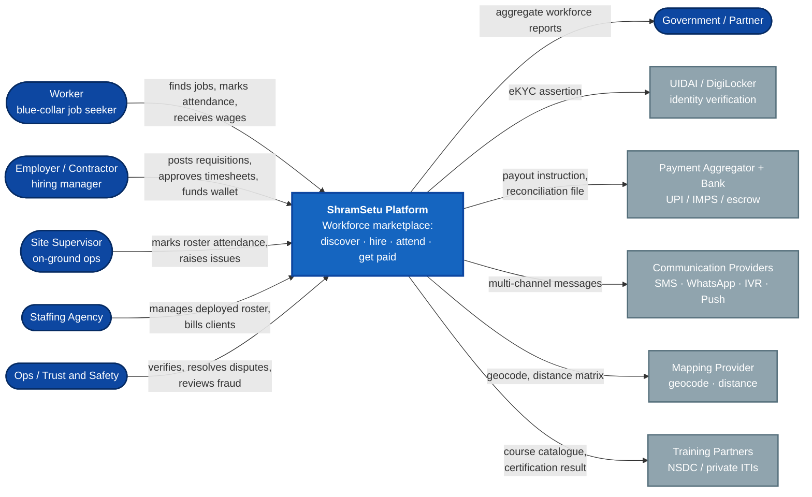

---

## 2.5 Deployment Topology

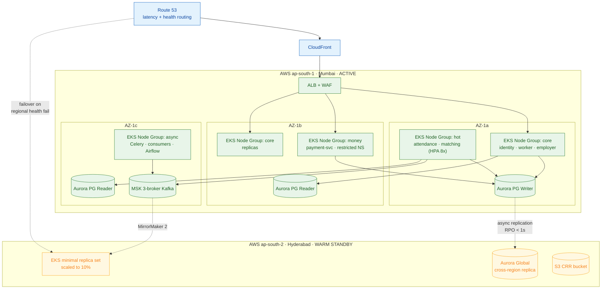

---

## 2.6 Module Map — Repository & Service Layout

```
shramsetu/
├── apps/
│   ├── mobile/                    # React Native (Worker + Employer flavours)
│   │   ├── src/modules/{auth,feed,profile,attendance,earnings,learning}/
│   │   ├── src/offline/           # WatermelonDB models, outbox, sync engine
│   │   └── src/native/            # liveness (TFLite), geofence, Play Integrity
│   ├── web-employer/              # React 18 + Vite  (HR / agency console)
│   └── web-ops/                   # React 18 + Vite  (internal ops console)
├── packages/
│   ├── api-client/                # OpenAPI-generated TS SDK (shared RN + web)
│   ├── design-system/             # tokens, primitives, RN + web adapters
│   ├── i18n/                      # 12 locale bundles + audio strings
│   └── validation/                # Zod schemas generated from Pydantic models
├── services/                      # every service has the SAME 4-layer skeleton
│   ├── identity/
│   │   └── app/{api,application,domain,infrastructure}/
│   ├── worker/  employer/  matching/  application/  attendance/
│   ├── payment/ notification/ trust/ learning/ search/ analytics/ admin/
│   └── bff_mobile/  bff_web/
├── libs/
│   └── shramsetu_core/            # shared Python library
│       ├── auth/        # JWT verify, RBAC/ABAC policy engine
│       ├── events/      # Avro schemas, outbox publisher, idempotent consumer
│       ├── db/          # async session, unit-of-work, tenancy guard, RLS helpers
│       ├── observability/  # OTel setup, structured logging, PII redaction
│       ├── resilience/  # circuit breaker, retry with jitter, bulkhead, timeouts
│       └── money/       # Decimal money type, currency, rounding policy
├── infra/
│   ├── terraform/   helm/   k8s/   airflow-dags/
└── docs/
    └── SYSTEM_DESIGN.md
```

**Canonical service skeleton (hexagonal / ports-and-adapters):**

```
services/<name>/app/
├── api/              # FastAPI routers, request/response Pydantic v2 schemas, deps
├── application/      # use-cases (command/query handlers), sagas, unit-of-work
├── domain/           # entities, value objects, domain events, invariants — NO I/O
├── infrastructure/   # SQLAlchemy repos, Kafka producer/consumer, HTTP clients
└── main.py           # composition root: wire ports to adapters
```

---

# 3. WORKFLOW & PROCESS FLOW

## 3.1 The Primary Journey — "Discover → Hire → Work → Get Paid"

The platform's single most important flow spans six phases and crosses nine services. Each phase
has an explicit exit criterion and an owning module.

| # | Phase | Owning module | Exit criterion | Target duration |
|---|-------|---------------|----------------|-----------------|
| 1 | **Onboard & Verify** | identity, worker | `kyc_status = VERIFIED` and profile ≥ 60 % complete | < 6 min |
| 2 | **Discover & Match** | matching, search | Worker sees ≥ 10 relevant jobs; employer sees ≥ 20 candidates | < 1 s (cached feed) |
| 3 | **Apply & Hire** | application, notification | `application.status = JOINED` | < 72 h (median) |
| 4 | **Work & Attend** | attendance | Daily `punch` pair recorded and validated | per shift |
| 5 | **Approve & Pay** | attendance, payment | `payout.status = SETTLED` | T+1 by 18:00 IST |
| 6 | **Rate & Reinforce** | trust, learning | Ratings exchanged, scores updated, skills nudged | < 24 h post-engagement |

---

## 3.2 End-to-End Process Flow

```mermaid
flowchart LR
    Start(["Worker installs app"]) --> P1

    subgraph P1["PHASE 1 · ONBOARD & VERIFY"]
        direction TB
        A1["Enter mobile number<br/>select language"] --> A2["OTP via SMS<br/>fallback: WhatsApp, voice"]
        A2 --> A3{"OTP valid?"}
        A3 -->|"No · 3 attempts"| A4["Lockout 15 min<br/>offer voice OTP"]
        A4 --> A2
        A3 -->|"Yes"| A5["Issue JWT + refresh<br/>bind device"]
        A5 --> A6["Guided profile:<br/>trade, skills, wage, radius"]
        A6 --> A7{"eKYC path?"}
        A7 -->|"DigiLocker"| A8["OAuth to DigiLocker<br/>pull Aadhaar XML"]
        A7 -->|"Offline XML"| A9["Upload ZIP + share-code"]
        A7 -->|"Skip for now"| A10["Status = PENDING_KYC<br/>capped: apply to 3 jobs"]
        A8 --> A11{"Name + face<br/>match?"}
        A9 --> A11
        A11 -->|"Yes"| A12["kyc_status = VERIFIED<br/>store hashed ref + last4 only"]
        A11 -->|"No"| A13["Ops manual review queue<br/>SLA 4 h"]
        A13 --> A12
    end

    P1 --> P2

    subgraph P2["PHASE 2 · DISCOVER & MATCH"]
        direction TB
        B1["Feed request<br/>geo + filters"] --> B2{"Redis feed<br/>cache hit?"}
        B2 -->|"Hit · TTL 5 min"| B3["Return ranked feed<br/>p95 250 ms"]
        B2 -->|"Miss"| B4["Stage 1 RECALL<br/>PostGIS radius + skill inverted index<br/>+ pgvector ANN → ~500 candidates"]
        B4 --> B5["Stage 2 RANK<br/>LightGBM: distance, skill overlap,<br/>wage fit, reliability, affinity"]
        B5 --> B6["Apply fairness floor<br/>+ dedupe + business rules"]
        B6 --> B7["Cache and return<br/>p95 800 ms"]
        B3 --> B8["Worker browses<br/>explainable match cards"]
        B7 --> B8
    end

    P2 --> P3

    subgraph P3["PHASE 3 · APPLY & HIRE"]
        direction TB
        C1["One-tap APPLY<br/>idempotency key"] --> C2{"Eligible?<br/>KYC, quota, blocklist"}
        C2 -->|"No"| C3["Show reason<br/>+ remediation CTA"]
        C3 --> B8
        C2 -->|"Yes"| C4["application = APPLIED<br/>outbox event"]
        C4 --> C5["Notify employer<br/>push + WhatsApp"]
        C5 --> C6{"Employer<br/>decision"}
        C6 -->|"Reject"| C7["REJECTED + reason<br/>notify worker, suggest similar"]
        C6 -->|"Shortlist"| C8["SHORTLISTED<br/>masked call enabled"]
        C8 --> C9{"Interview<br/>required?"}
        C9 -->|"Yes"| C10["Schedule slot<br/>reminders T-24h, T-1h"]
        C10 --> C11{"Outcome"}
        C11 -->|"Fail / no-show"| C7
        C11 -->|"Pass"| C12
        C9 -->|"No"| C12["OFFERED<br/>digital offer + e-sign consent"]
        C12 --> C13{"Worker<br/>accepts in 48 h?"}
        C13 -->|"Expired"| C14["OFFER_LAPSED<br/>backfill from waitlist"]
        C14 --> C6
        C13 -->|"Yes"| C15["ACCEPTED → ESCROW HOLD<br/>on employer wallet"]
        C15 --> C16{"Wallet<br/>sufficient?"}
        C16 -->|"No"| C17["Block join<br/>prompt top-up"]
        C17 --> C16
        C16 -->|"Yes"| C18["JOINED<br/>roster entry created"]
    end

    P3 --> P4

    subgraph P4["PHASE 4 · WORK & ATTEND"]
        direction TB
        D1["Shift start<br/>geofence armed"] --> D2{"Device<br/>online?"}
        D2 -->|"No"| D3["Write punch to local SQLite<br/>outbox · ack in 50 ms"]
        D3 --> D4["Background sync on<br/>connectivity regained"]
        D2 -->|"Yes"| D5["POST punch<br/>GPS + selfie + integrity token"]
        D4 --> D5
        D5 --> D6{"Validations:<br/>geofence, liveness,<br/>mock-GPS, attestation"}
        D6 -->|"Fail"| D7["FLAGGED<br/>supervisor override required"]
        D7 --> D8
        D6 -->|"Pass"| D8["punch VALIDATED<br/>timesheet line updated"]
        D8 --> D9{"Shift<br/>complete?"}
        D9 -->|"No"| D1
        D9 -->|"Yes"| D10["Daily timesheet<br/>OT + breaks computed"]
    end

    P4 --> P5

    subgraph P5["PHASE 5 · APPROVE & PAY"]
        direction TB
        E1["Supervisor reviews<br/>timesheet"] --> E2{"Approve?"}
        E2 -->|"Dispute"| E3["Grievance ticket<br/>SLA 24 h · ops arbitration"]
        E3 --> E1
        E2 -->|"Auto-approve after 48 h"| E4
        E2 -->|"Yes"| E4["timesheet APPROVED<br/>immutable snapshot"]
        E4 --> E5["Payroll engine:<br/>gross, OT, deductions,<br/>advances, net"]
        E5 --> E6["Ledger: DEBIT escrow<br/>CREDIT worker payable"]
        E6 --> E7["Payout instruction<br/>idempotency key"]
        E7 --> E8{"UPI / IMPS<br/>result"}
        E8 -->|"Success"| E9["SETTLED<br/>ledger finalised · receipt"]
        E8 -->|"Retryable failure"| E10["Backoff retry ≤ 5<br/>2m, 8m, 30m, 2h, 6h"]
        E10 --> E8
        E8 -->|"Terminal failure"| E11["FAILED<br/>reverse ledger · notify<br/>prompt bank-detail fix"]
        E11 --> E12["Ops assisted payout"]
        E8 -->|"Timeout / unknown"| E13["Status reconciliation job<br/>never re-debit"]
        E13 --> E8
    end

    P5 --> P6

    subgraph P6["PHASE 6 · RATE & REINFORCE"]
        direction TB
        F1["Mutual rating prompt"] --> F2["Reliability + Employer<br/>scores recomputed"]
        F2 --> F3["work_record appended<br/>to Skill Passport"]
        F3 --> F4{"Skill gap vs<br/>local demand?"}
        F4 -->|"Yes"| F5["Recommend micro-course<br/>+ assessment"]
        F4 -->|"No"| F6["Recommend repeat/similar<br/>employers"]
        F5 --> F7(["Re-enters matching pool<br/>with stronger signals"])
        F6 --> F7
    end

    P6 --> End(["Higher match quality<br/>on next cycle"])

    classDef phase fill:#f5f5f5,stroke:#616161,stroke-width:2px
    classDef decision fill:#fff8e1,stroke:#f9a825,color:#e65100
    classDef fail fill:#ffebee,stroke:#c62828,color:#b71c1c
    classDef success fill:#e8f5e9,stroke:#2e7d32,color:#1b5e20
    class A3,A7,A11,B2,C2,C6,C9,C11,C13,C16,D2,D6,D9,E2,E8,F4 decision
    class A4,C3,C7,C14,C17,D7,E3,E10,E11,E13 fail
    class A12,B3,B7,C18,D8,E9,F7 success
```

---

## 3.3 Employer-Side Flow — Requisition to Fulfilment

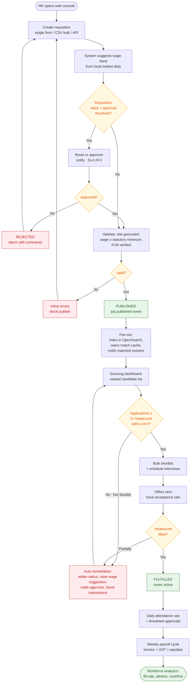

---

## 3.4 Offline-First Sync Workflow (Mobile)

The single most important client-side mechanism: the worker app must remain useful on a 2G
connection in a basement construction site.

```mermaid
flowchart LR
    subgraph DEVICE["ON DEVICE"]
        U["User action<br/>punch / apply / profile edit"] --> L["Write to local SQLite<br/>WatermelonDB"]
        L --> OB[("Outbox table<br/>op, payload, idem_key,<br/>attempt, next_retry_at")]
        L --> UI["Optimistic UI update<br/>ack ≤ 50 ms"]
        OB --> SE{"Sync engine<br/>trigger"}
        SE -->|"connectivity regained"| BATCH
        SE -->|"app foreground"| BATCH
        SE -->|"periodic 15 min<br/>WorkManager / BGTask"| BATCH
        BATCH["Batch ≤ 50 ops<br/>gzip · ordered by created_at"]
    end

    BATCH --> API["POST /v1/sync/batch<br/>Idempotency-Key per op"]

    subgraph SERVER["SERVER"]
        API --> DE{"Idempotency store<br/>seen key?"}
        DE -->|"Yes"| CACHED["Return cached result<br/>no side effects"]
        DE -->|"No"| PROC["Process op<br/>per-module handler"]
        PROC --> CF{"Conflict?"}
        CF -->|"No"| OK["Apply · persist ·<br/>emit domain event"]
        CF -->|"Yes"| RES["Resolution policy<br/>see table below"]
        RES --> OK
        OK --> RESP["Per-op result array<br/>+ server cursor"]
        CACHED --> RESP
    end

    RESP --> APPLY["Client applies results:<br/>clear outbox rows,<br/>rebase local state"]
    APPLY --> PULL["GET /v1/sync/pull?cursor=<br/>delta changes since cursor"]
    PULL --> DONE(["Local store consistent"])

    classDef device fill:#e3f2fd,stroke:#1565c0,color:#0d47a1
    classDef server fill:#fff3e0,stroke:#ef6c00,color:#e65100
    class U,L,OB,UI,SE,BATCH device
    class API,DE,PROC,CF,OK,RES,RESP,CACHED server
```

### Conflict-Resolution Policy Matrix

| Entity | Strategy | Rule |
|--------|----------|------|
| Attendance punch | **Server-authoritative, append-only** | Punches are immutable facts; duplicates collapse on `(worker_id, shift_id, punch_type, minute_bucket)` |
| Profile fields | **Last-write-wins per field** | Field-level `updated_at` vectors, not whole-document LWW |
| Application submit | **Idempotent create** | `Idempotency-Key = sha256(worker_id, job_id, day)` |
| Timesheet approval | **Server rejects stale** | Optimistic concurrency via `version`; client refetches on 409 |
| Document upload | **Content-addressed** | S3 key = `sha256(bytes)`; re-upload is a no-op |
| Ledger/money ops | **Never client-originated** | Clients may only *request*; the server alone writes ledger entries |

---

# 4. LOW-LEVEL DESIGN (LLD) & COMPONENT INTERACTIONS

## 4.1 Internal Structure of a Service (canonical, using `attendance-svc`)

Every service follows the same hexagonal layering. `domain/` has zero I/O imports — it is pure,
fast to test, and the only place business invariants live.

```python
# ── services/attendance/app/domain/entities.py ────────────────────────────────
from __future__ import annotations
from dataclasses import dataclass, field
from datetime import datetime, timedelta
from decimal import Decimal
from enum import StrEnum
from uuid import UUID, uuid4


class PunchType(StrEnum):
    CHECK_IN = "CHECK_IN"
    CHECK_OUT = "CHECK_OUT"
    BREAK_START = "BREAK_START"
    BREAK_END = "BREAK_END"


class PunchStatus(StrEnum):
    PENDING = "PENDING"          # accepted, validations queued
    VALIDATED = "VALIDATED"      # all checks passed
    FLAGGED = "FLAGGED"          # anomaly; needs supervisor override
    REJECTED = "REJECTED"        # override denied / proven spoof
    OVERRIDDEN = "OVERRIDDEN"    # supervisor manually accepted


@dataclass(frozen=True, slots=True)
class GeoPoint:
    lat: float
    lon: float
    accuracy_m: float

    def __post_init__(self) -> None:
        if not (-90 <= self.lat <= 90) or not (-180 <= self.lon <= 180):
            raise ValueError("coordinates out of range")


@dataclass(frozen=True, slots=True)
class Geofence:
    centre: GeoPoint
    radius_m: int

    def contains(self, p: GeoPoint) -> bool:
        # Tolerance absorbs consumer-GPS error; capped so it cannot be gamed.
        tolerance = min(p.accuracy_m, 75.0)
        return haversine_m(self.centre, p) <= self.radius_m + tolerance


@dataclass(slots=True)
class Punch:
    """Append-only fact. Never mutated after VALIDATED except by explicit override."""
    id: UUID
    worker_id: UUID
    shift_id: UUID
    site_id: UUID
    punch_type: PunchType
    occurred_at: datetime            # device clock, trusted only after skew check
    received_at: datetime            # server clock — authoritative for ordering
    location: GeoPoint
    selfie_key: str | None
    device_id: str
    integrity_verdict: str           # Play Integrity / DeviceCheck result
    status: PunchStatus = PunchStatus.PENDING
    anomaly_codes: list[str] = field(default_factory=list)
    source: str = "MOBILE"           # MOBILE | QR | SUPERVISOR | NFC

    MAX_CLOCK_SKEW = timedelta(minutes=5)

    def validate(self, fence: Geofence, liveness_score: float,
                 face_match_score: float, server_now: datetime) -> None:
        """Pure domain validation. Collects every anomaly rather than short-circuiting,
        so the supervisor sees the full picture in one review."""
        anomalies: list[str] = []

        if abs(self.occurred_at - server_now) > self.MAX_CLOCK_SKEW:
            anomalies.append("CLOCK_SKEW")
        if not fence.contains(self.location):
            anomalies.append("OUTSIDE_GEOFENCE")
        if self.location.accuracy_m > 150:
            anomalies.append("LOW_GPS_ACCURACY")
        if self.integrity_verdict != "MEETS_DEVICE_INTEGRITY":
            anomalies.append("DEVICE_INTEGRITY_FAIL")
        if liveness_score < 0.85:
            anomalies.append("LIVENESS_FAIL")
        if face_match_score < 0.72:
            anomalies.append("FACE_MISMATCH")

        self.anomaly_codes = anomalies
        self.status = PunchStatus.VALIDATED if not anomalies else PunchStatus.FLAGGED

    def override(self, supervisor_id: UUID, reason: str) -> "PunchOverridden":
        if self.status is not PunchStatus.FLAGGED:
            raise IllegalStateTransition(f"cannot override a {self.status} punch")
        self.status = PunchStatus.OVERRIDDEN
        return PunchOverridden(self.id, supervisor_id, reason, self.anomaly_codes)


@dataclass(slots=True)
class Timesheet:
    """Aggregate root: owns punch→payable-hours computation and the approval invariant."""
    id: UUID
    worker_id: UUID
    job_id: UUID
    work_date: datetime
    punches: list[Punch]
    wage_config: "WageConfig"
    status: str = "DRAFT"
    version: int = 0                 # optimistic concurrency token

    def compute(self) -> "TimesheetLine":
        pairs = self._pair_punches()          # tolerant of missing CHECK_OUT
        worked = sum((p.duration for p in pairs), timedelta())
        breaks = self._break_duration()
        net = max(worked - breaks, timedelta())
        regular = min(net, self.wage_config.standard_hours)
        overtime = max(net - self.wage_config.standard_hours, timedelta())
        return TimesheetLine(
            regular_hours=_to_hours(regular),
            overtime_hours=_to_hours(overtime),
            gross=self.wage_config.gross_for(regular, overtime),  # Decimal, never float
        )

    def approve(self, approver_id: UUID, expected_version: int) -> "TimesheetApproved":
        if expected_version != self.version:
            raise ConcurrencyConflict(current=self.version)       # → HTTP 409
        if any(p.status is PunchStatus.FLAGGED for p in self.punches):
            raise UnresolvedAnomalies("resolve flagged punches before approval")
        self.status, self.version = "APPROVED", self.version + 1
        return TimesheetApproved(self.id, approver_id, self.compute())
```

```python
# ── services/attendance/app/application/record_punch.py ───────────────────────
class RecordPunchHandler:
    """Use-case: orchestrates ports; contains no business rules itself."""

    def __init__(self, uow: UnitOfWork, sites: SitePort, vision: VisionPort,
                 fraud: FraudPort, clock: Clock, events: EventPublisher) -> None:
        self._uow, self._sites, self._vision = uow, sites, vision
        self._fraud, self._clock, self._events = fraud, clock, events

    async def handle(self, cmd: RecordPunchCommand) -> PunchResult:
        async with self._uow:
            # 1. Idempotency — replay-safe for the mobile outbox.
            if prior := await self._uow.punches.find_by_idempotency(cmd.idempotency_key):
                return PunchResult.from_entity(prior, replayed=True)

            shift = await self._uow.shifts.get_active(cmd.worker_id, self._clock.now())
            if shift is None:
                raise NoActiveShift(cmd.worker_id)

            fence = await self._sites.geofence(shift.site_id)          # Redis-cached 1 h

            punch = Punch(id=uuid4(), worker_id=cmd.worker_id, shift_id=shift.id,
                          site_id=shift.site_id, punch_type=cmd.punch_type,
                          occurred_at=cmd.occurred_at, received_at=self._clock.now(),
                          location=cmd.location, selfie_key=cmd.selfie_key,
                          device_id=cmd.device_id,
                          integrity_verdict=cmd.integrity_verdict)

            # 2. Vision checks: bounded, with a safe degraded default.
            try:
                async with timeout(1.2):
                    v = await self._vision.verify(cmd.selfie_key, cmd.worker_id)
                liveness, face = v.liveness_score, v.face_match_score
            except (TimeoutError, CircuitOpen):
                # Never block a worker's wage on our ML availability — flag for review.
                liveness, face = 1.0, 1.0
                punch.anomaly_codes.append("VISION_UNAVAILABLE")

            punch.validate(fence, liveness, face, self._clock.now())

            await self._uow.punches.add(punch, cmd.idempotency_key)
            await self._uow.timesheets.upsert_line(punch)
            # 3. Transactional outbox — event and state commit atomically.
            await self._uow.outbox.enqueue(PunchRecorded.from_(punch))
            await self._uow.commit()

        if punch.status is PunchStatus.FLAGGED:
            await self._fraud.report_async(punch)   # fire-and-forget, own retry
        return PunchResult.from_entity(punch, replayed=False)
```

### Module-by-Module Internal Design

| Module | Key classes / components | Critical algorithm or invariant |
|--------|--------------------------|----------------------------------|
| **identity** | `OtpChallenge`, `SessionManager`, `KycVerifier`, `PolicyEngine` | Rate-limited OTP (3/15 min/number, 10/h/IP), HMAC-hashed OTP at rest, refresh-token rotation with reuse detection → session family revoked |
| **worker** | `WorkerProfile`, `SkillPassport`, `WorkRecord`, `DocumentVault`, `CompletenessCalculator` | `work_record` is append-only and platform-signed (Ed25519); passport QR carries a verifiable JWS |
| **employer** | `Organisation`, `Site`, `Requisition`, `ApprovalChain`, `WageBenchmarkService` | Requisition cannot publish below statutory minimum wage for its state + skill category |
| **matching** | `RecallStage`, `RankingStage`, `FairnessReranker`, `FeatureAssembler`, `MatchExplainer` | Recall ≤ 40 ms (PostGIS + inverted index + ANN), rank ≤ 60 ms for 500 candidates |
| **application** | `Application` aggregate, `HiringSaga`, `StateMachine`, `OfferExpiryScheduler` | Every transition is guarded and audited; illegal transitions raise, never silently pass |
| **attendance** | `Punch`, `Timesheet`, `Roster`, `GeofenceValidator`, `AnomalyDetector` | Append-only punches; timesheet approval requires zero unresolved anomalies |
| **payment** | `Ledger`, `JournalEntry`, `EscrowHold`, `PayoutOrchestrator`, `Reconciler` | **Sum of all debits == sum of all credits, always**; enforced by a DB constraint + hourly audit job |
| **notification** | `TemplateRegistry`, `ChannelCascade`, `PreferenceResolver`, `DeliveryTracker` | Cascade stops at first success; frequency cap per user per category per day |
| **trust** | `ReliabilityScorer`, `FraudRuleEngine`, `GrievanceWorkflow`, `SosDispatcher` | Scores are recomputed, never incrementally patched — reproducible from events |
| **learning** | `Course`, `Enrolment`, `Assessment`, `BadgeIssuer` | Badge issuance writes a verified skill into the passport (cross-module event) |
| **search** | `IndexProjector`, `QueryBuilder`, `IndicAnalyzer` | Owns no truth; fully rebuildable from Kafka replay |
| **analytics** | `EventIngestor`, `MartBuilder`, `ReportRenderer` | Never reads OLTP; tenant isolation enforced in every query template |
| **admin** | `FeatureFlagStore`, `TaxonomyManager`, `AuditLogger` | Audit entries are hash-chained (`prev_hash`) → tamper-evident |

---

## 4.2 Sequence Diagram — Worker Onboarding with eKYC

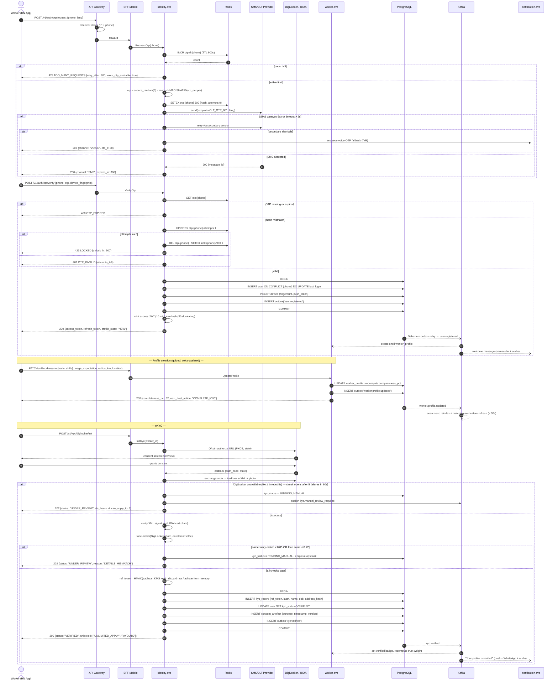

---

## 4.3 Sequence Diagram — Job Feed Generation (Two-Stage Matching)

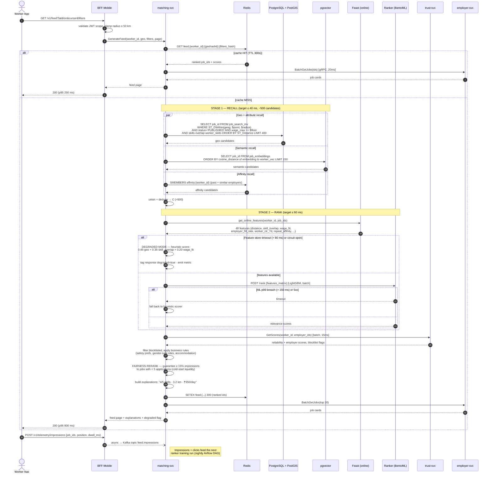

---

## 4.4 Sequence Diagram — Apply → Offer → Join (Hiring Saga with Escrow)

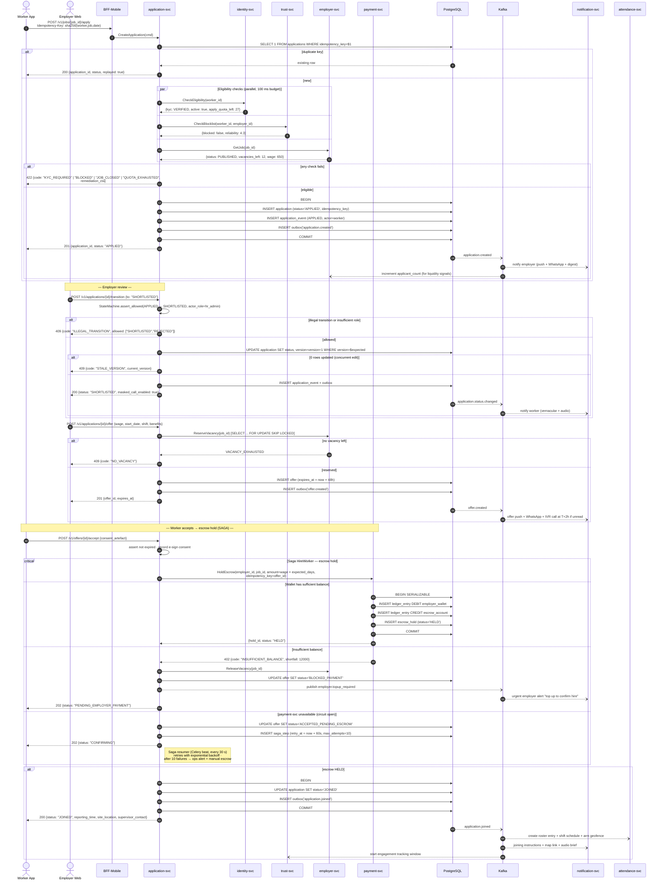

---

## 4.5 Sequence Diagram — Offline Attendance Punch and Batch Sync

```mermaid
sequenceDiagram
    autonumber
    actor W as Worker
    participant APP as RN App
    participant SQL as Local SQLite (WatermelonDB)
    participant SYNC as Sync Engine (WorkManager)
    participant GW as API Gateway
    participant ATS as attendance-svc
    participant IDEM as Idempotency Store (Redis)
    participant S3 as S3
    participant ML as Vision Service
    participant PG as PostgreSQL
    participant K as Kafka
    participant SUP as Supervisor App

    W->>APP: taps CHECK IN at site
    APP->>APP: acquire GPS (timeout 8s, desiredAccuracy 50m)
    APP->>APP: capture selfie + on-device TFLite liveness pre-check

    alt on-device liveness < 0.6
        APP-->>W: "Face not clear — please retry in better light"
    else pre-check passes
        APP->>APP: request Play Integrity / DeviceCheck token
        APP->>SQL: INSERT punch (status='QUEUED', idem_key=uuidv7,<br/>selfie stored in app sandbox)
        SQL-->>APP: committed
        APP-->>W: ✓ "Checked in at 08:42" (optimistic, ≤ 50 ms)

        alt device ONLINE
            APP->>SYNC: trigger immediate sync
        else device OFFLINE
            Note over SQL,SYNC: Punch waits in outbox.<br/>WorkManager retries on connectivity,<br/>app foreground, or every 15 min.
        end
    end

    SYNC->>SYNC: collect ≤ 50 ops, ordered by created_at, gzip
    SYNC->>S3: PUT selfie via pre-signed URL (resumable, WiFi-preferred)
    alt upload fails after 3 attempts
        SYNC->>SYNC: keep bytes locally · submit punch with selfie_key=null<br/>and flag PENDING_MEDIA
    end
    SYNC->>GW: POST /v1/sync/batch {ops[], device_clock, app_version}
    GW->>ATS: BatchSync

    loop for each op in batch
        ATS->>IDEM: SET NX idem:{key} EX 86400
        alt key already present
            IDEM-->>ATS: not set (duplicate)
            ATS->>PG: SELECT cached result
            ATS-->>ATS: append {status: "REPLAYED", punch_id}
        else first time
            ATS->>PG: SELECT active shift for (worker, timestamp)
            alt no active shift
                ATS-->>ATS: append {status: "REJECTED", code: "NO_ACTIVE_SHIFT"}
            else shift found
                ATS->>ATS: Punch.validate(geofence, clock skew, GPS accuracy, integrity)

                alt selfie present
                    ATS->>ML: verify(selfie_key, worker_id) [timeout 1.2s]
                    alt ML timeout or circuit OPEN
                        ML-->>ATS: ✗
                        ATS->>ATS: anomaly += VISION_UNAVAILABLE (do not block wages)
                    else ML responds
                        ML-->>ATS: {liveness: 0.93, face_match: 0.81}
                    end
                end

                alt anomalies present
                    ATS->>PG: INSERT punch (status='FLAGGED', anomaly_codes[])
                    ATS->>PG: INSERT outbox('punch.flagged')
                    ATS-->>ATS: append {status: "FLAGGED", requires_override: true}
                    K--)SUP: supervisor review card (real-time)
                else clean
                    ATS->>PG: BEGIN
                    ATS->>PG: INSERT punch (status='VALIDATED')
                    ATS->>PG: UPSERT timesheet_line (recompute hours)
                    ATS->>PG: INSERT outbox('punch.recorded')
                    ATS->>PG: COMMIT
                    ATS-->>ATS: append {status: "VALIDATED", server_time}
                end
            end
        end
    end

    ATS-->>SYNC: 200 {results[], server_cursor, server_time}
    SYNC->>SQL: apply results — delete acked rows,<br/>mark rejects for user review,<br/>correct local clock drift
    SYNC->>GW: GET /v1/sync/pull?cursor={server_cursor}
    GW->>ATS: DeltaPull
    ATS-->>SYNC: {roster_changes, approvals, announcements}
    SYNC->>SQL: merge deltas (field-level LWW)
    SQL-->>APP: reactive query → UI updates

    Note over SUP,PG: — Supervisor resolves a flagged punch —
    SUP->>ATS: POST /v1/punches/{id}/override {reason: "GPS drift inside basement"}
    ATS->>ATS: assert actor is supervisor of that site (ABAC)
    ATS->>PG: UPDATE punch SET status='OVERRIDDEN' · INSERT audit_log (hash-chained)
    ATS->>PG: INSERT outbox('punch.overridden')
    PG--)K: punch.overridden → trust-svc (override-rate fraud signal)
```

---

## 4.6 Sequence Diagram — Payroll Run and Payout with Retries and Reconciliation

This is the most safety-critical path in the platform. **Invariant: money never moves twice, and
never disappears.** Every step is idempotent and every failure has a compensating action.

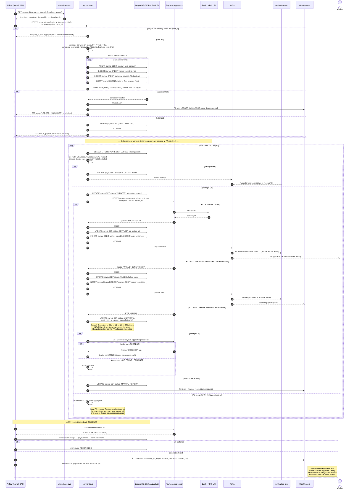

---

## 4.7 State Machines

### Application Lifecycle

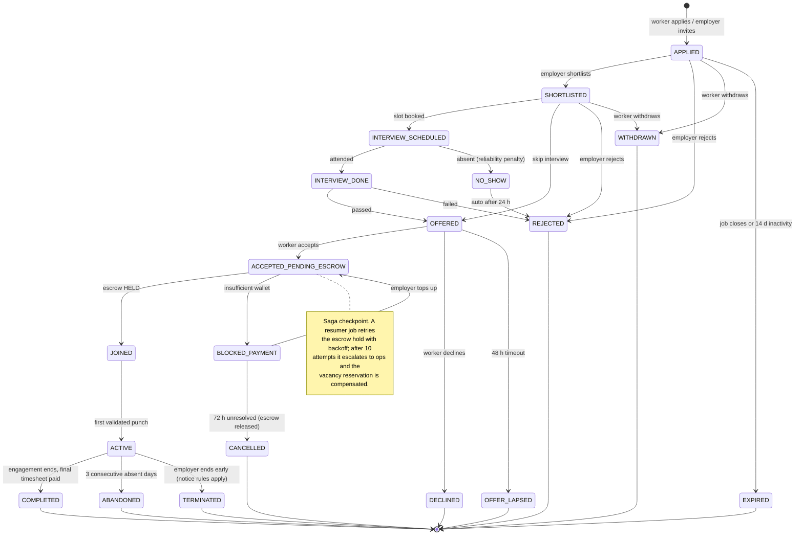

### Payout Lifecycle

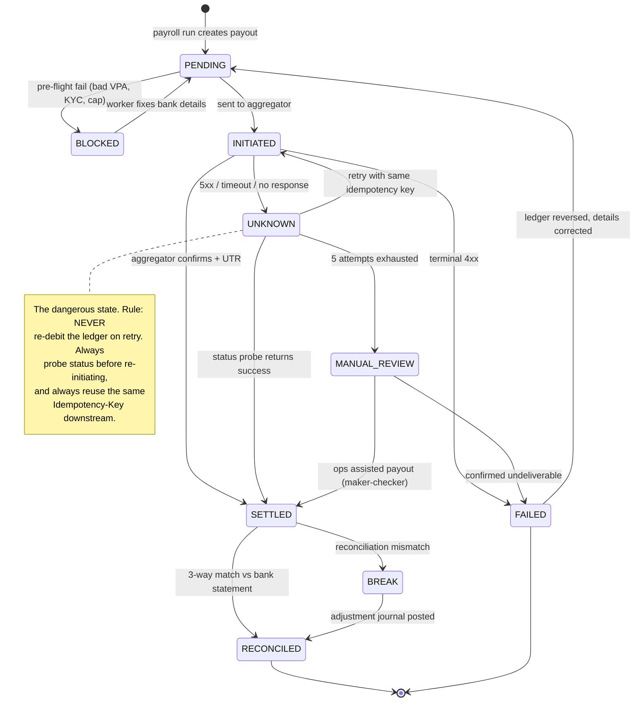

---

## 4.8 Key API Contracts

All endpoints are versioned (`/v1`), return RFC 9457 `application/problem+json` on error, and
require `Idempotency-Key` on every non-idempotent mutation.

```http
POST /v1/jobs/{job_id}/apply
Authorization: Bearer <jwt>
Idempotency-Key: 9f2c...e41
Content-Type: application/json

{ "source": "FEED", "position": 3, "expected_wage": 650, "available_from": "2026-09-20" }

201 Created
{
  "application_id": "app_01J8Z...",
  "status": "APPLIED",
  "job": { "id": "job_01J8...", "title": "Shuttering Carpenter", "wage_per_day": 650 },
  "next_steps": ["Employer reviews in ~4 h", "Keep your phone reachable"],
  "created_at": "2026-09-15T09:14:22Z"
}

422 Unprocessable Entity
{
  "type": "https://errors.shramsetu.in/kyc-required",
  "title": "Identity verification required",
  "status": 422,
  "code": "KYC_REQUIRED",
  "detail": "Complete eKYC to apply to more than 3 jobs.",
  "remediation": { "cta": "VERIFY_NOW", "deeplink": "shramsetu://kyc/start" },
  "trace_id": "0af7651916cd43dd8448eb211c80319c"
}
```

```http
POST /v1/sync/batch                     # mobile outbox drain
{
  "device_clock": "2026-09-15T08:42:11+05:30",
  "app_version": "3.4.1",
  "ops": [
    { "op_id": "018f...", "type": "PUNCH", "idempotency_key": "018f...",
      "payload": { "punch_type": "CHECK_IN", "occurred_at": "2026-09-15T08:42:03+05:30",
                   "lat": 19.0760, "lon": 72.8777, "accuracy_m": 18,
                   "selfie_key": "s3://punch-media/2026/09/15/018f.jpg",
                   "integrity_verdict": "MEETS_DEVICE_INTEGRITY" } }
  ]
}

207 Multi-Status
{
  "server_time": "2026-09-15T09:01:44Z",
  "server_cursor": "c_8821993",
  "results": [
    { "op_id": "018f...", "status": "VALIDATED", "entity_id": "pun_01J8...",
      "clock_drift_ms": -2400 }
  ]
}
```

```protobuf
// Internal gRPC — matching-svc ← BFF
service MatchingService {
  rpc GenerateFeed (FeedRequest) returns (FeedResponse);
  rpc SourceCandidates (SourcingRequest) returns (CandidateResponse);
}

message FeedRequest {
  string worker_id = 1;
  GeoPoint location = 2;
  FeedFilters filters = 3;
  string cursor = 4;
  uint32 page_size = 5;          // clamped to 20
}

message MatchExplanation {
  uint32 skills_matched = 1;
  uint32 skills_total = 2;
  float distance_km = 3;
  string wage_fit = 4;           // BELOW | AT | ABOVE expectation
  repeated string highlights = 5; // "Repeat employer", "Accommodation provided"
}
```

### Event Catalogue (Kafka, Avro, Schema-Registry enforced)

| Topic | Key | Partitions | Retention | Primary consumers |
|-------|-----|-----------:|-----------|-------------------|
| `identity.user.v1` | `user_id` | 12 | 30 d | worker, notification, analytics |
| `worker.profile.v1` | `worker_id` | 24 | 30 d | search, matching, trust |
| `employer.job.v1` | `job_id` | 24 | 30 d | search, matching, notification |
| `application.lifecycle.v1` | `application_id` | 24 | 90 d | notification, trust, analytics, payment |
| `attendance.punch.v1` | `worker_id` | **48** | 7 d | timesheet projector, trust, analytics |
| `payment.payout.v1` | `payout_id` | 12 | **365 d** (compliance) | notification, analytics, recon |
| `trust.score.v1` | `subject_id` | 12 | 30 d | matching, employer |
| `feed.impressions.v1` | `worker_id` | 48 | 7 d | ML training pipeline |

**Delivery semantics:** at-least-once. Every consumer is idempotent via a
`(topic, partition, offset)` or business-key dedupe table. Ordering is guaranteed per key, which
is sufficient because all aggregates are keyed by their own identity.

---

# 5. DATA MODELS & STORAGE STRATEGY

## 5.1 Polyglot Persistence — Choices and Justification

| Store | Technology | Holds | Why this store |
|-------|-----------|-------|----------------|
| **Primary OLTP** | PostgreSQL 16 (Aurora), one logical DB per service | Users, profiles, jobs, applications, punches, rosters | Relational integrity and multi-row transactions are non-negotiable for hiring and attendance. `JSONB` covers schema-flexible attributes; PostGIS handles geo natively, removing a whole separate geo store. Mature ops, point-in-time recovery, logical replication for CDC. |
| **Financial ledger** | PostgreSQL 16, **separate cluster**, `SERIALIZABLE` isolation, restricted network namespace | `ledger_entries`, `payouts`, `escrow_holds`, `invoices` | Money demands ACID + auditable immutability + a blast-radius boundary. Physical separation also narrows the compliance audit scope. |
| **Geospatial** | PostGIS (`GEOGRAPHY(Point,4326)` + GiST) | Site locations, worker home/work points, punch coordinates | `ST_DWithin` on a GiST index returns a 25 km radius query over 800 K jobs in ~12 ms. A dedicated geo database would add a sync problem for no gain. |
| **Vector/semantic** | **pgvector** (HNSW index) in the worker DB | Skill and job-description embeddings (384-d, MiniLM-Indic) | Keeps embeddings transactionally consistent with the rows they describe. At our cardinality (≤ 5 M vectors) HNSW in Postgres matches a dedicated vector DB and removes an operational component. |
| **Cache / ephemeral** | Redis 7 Cluster | Feed cache, sessions, OTP, rate limits, idempotency keys, distributed locks, Celery broker | Sub-ms reads, native TTL, atomic `SET NX` for idempotency, Lua for token buckets. |
| **Search** | OpenSearch 2.x | Job + worker indices with Indic analysers | Typo tolerance, multi-language stemming, faceting and geo filters that would be slow and brittle in SQL. |
| **Event log** | Kafka (MSK) + Avro Schema Registry | All domain events, CDC streams | Replayable log = rebuildable read models, decoupled consumers, and an audit trail of intent. |
| **OLAP** | ClickHouse | Dashboards, funnels, cohorts, heatmaps | Columnar scans over billions of punches/impressions at sub-second latency; ~10× cheaper than warehousing the same in Postgres. Keeps analytics traffic off OLTP entirely. |
| **Data lake** | S3 + Apache Iceberg + Trino | Raw events, ML features, 7-year regulatory archive | Cheap durable retention, schema evolution, open format for ad-hoc and ML access. |
| **Object storage** | S3 (SSE-KMS) + CloudFront signed URLs | Documents, selfies, course media, generated PDFs | Content-addressed keys, lifecycle to Glacier after 90 days, per-object access grants. |
| **Time-series** | Prometheus (+ Thanos) | Infra and app metrics | Standard, cheap, alert-native. |

### Explicit SQL vs NoSQL Decision

**We chose SQL (PostgreSQL) as the system of record, and deliberately avoided a document store
for core entities.**

*Reasoning:* our access patterns are relational and highly transactional — "hold escrow **and**
mark the application JOINED **and** create a roster entry" must be atomic within a service. Wage
computation reads across five related tables. Regulatory reporting demands ad-hoc joins. MongoDB
or DynamoDB would push those invariants into application code, where they degrade over time.

*Where NoSQL-style modelling does appear, it is scoped and intentional:*
- `JSONB` columns for genuinely open-ended attributes (job `benefits`, `metadata`, partner payloads).
- Redis for ephemeral, TTL-bound state.
- OpenSearch (denormalised documents) and ClickHouse (wide flat rows) as **derived, rebuildable
  read models** — never as sources of truth.

*The one place a NoSQL store is justified at scale:* `attendance.punches` grows to ~2 B rows in
three years. Rather than migrate to Cassandra/DynamoDB, we use **native Postgres declarative
partitioning by month** plus automated detachment of partitions older than 90 days to Iceberg on
S3. This keeps the hot working set at ~180 M rows (queryable in ms) while preserving SQL for the
whole history via Trino. Revisit only if write throughput exceeds ~15 K punches/s sustained.

---

## 5.2 Core Entity–Relationship Model

```mermaid
erDiagram
    USER ||--o| WORKER_PROFILE : "has"
    USER ||--o{ DEVICE : "registers"
    USER ||--o{ SESSION : "opens"
    USER ||--o| KYC_RECORD : "verified_by"
    USER ||--o{ CONSENT_ARTEFACT : "grants"
    USER }o--o{ ORG_MEMBERSHIP : "belongs_to"

    WORKER_PROFILE ||--o{ WORKER_SKILL : "claims"
    WORKER_PROFILE ||--o{ WORK_RECORD : "accumulates"
    WORKER_PROFILE ||--o{ DOCUMENT : "stores"
    WORKER_PROFILE ||--o{ AVAILABILITY_SLOT : "declares"
    WORKER_PROFILE ||--o{ BADGE : "earns"
    SKILL ||--o{ WORKER_SKILL : "referenced_by"
    SKILL ||--o{ JOB_SKILL : "required_by"

    ORGANISATION ||--o{ SITE : "operates"
    ORGANISATION ||--o{ ORG_MEMBERSHIP : "employs"
    ORGANISATION ||--|| WALLET : "funds"
    SITE ||--o{ JOB : "hosts"
    SITE ||--o{ SHIFT : "schedules"
    JOB ||--o{ JOB_SKILL : "requires"
    JOB ||--o{ APPLICATION : "receives"

    WORKER_PROFILE ||--o{ APPLICATION : "submits"
    APPLICATION ||--o{ APPLICATION_EVENT : "audits"
    APPLICATION ||--o| OFFER : "results_in"
    APPLICATION ||--o| ROSTER_ENTRY : "activates"

    ROSTER_ENTRY ||--o{ PUNCH : "records"
    SHIFT ||--o{ PUNCH : "scopes"
    ROSTER_ENTRY ||--o{ TIMESHEET : "produces"
    TIMESHEET ||--|| PAYROLL_LINE : "priced_as"
    PAYROLL_RUN ||--o{ PAYROLL_LINE : "contains"
    PAYROLL_LINE ||--|| PAYOUT : "disburses"
    PAYOUT ||--o{ LEDGER_ENTRY : "posts"
    WALLET ||--o{ LEDGER_ENTRY : "affects"
    WALLET ||--o{ ESCROW_HOLD : "reserves"
    ESCROW_HOLD ||--o{ LEDGER_ENTRY : "posts"

    APPLICATION ||--o{ RATING : "concludes_with"
    WORKER_PROFILE ||--o| RELIABILITY_SCORE : "scored_by"
    ORGANISATION ||--o| EMPLOYER_SCORE : "scored_by"
    USER ||--o{ GRIEVANCE : "raises"
    USER ||--o{ FRAUD_SIGNAL : "triggers"

    USER {
        uuid id PK
        string phone_e164 UK "encrypted, blind-indexed"
        string email
        enum status "ACTIVE BLOCKED DELETED"
        enum kyc_status "NONE PENDING VERIFIED REJECTED"
        string preferred_language
        timestamptz created_at
        timestamptz deleted_at "soft delete for DPDP"
    }

    KYC_RECORD {
        uuid id PK
        uuid user_id FK
        string aadhaar_ref_token "HMAC-KMS, never raw"
        string aadhaar_last4
        string name_as_per_id "field-encrypted"
        date dob
        string address_hash
        enum provider "DIGILOCKER OFFLINE_XML MANUAL"
        numeric face_match_score
        timestamptz verified_at
    }

    WORKER_PROFILE {
        uuid id PK
        uuid user_id FK,UK
        string full_name
        enum gender
        geography home_location "GEOGRAPHY Point 4326, GiST"
        int preferred_radius_km
        numeric expected_wage_per_day
        enum engagement_type "FULL_TIME PART_TIME SHIFT DAILY"
        jsonb languages
        int completeness_pct
        vector skill_embedding "pgvector 384d HNSW"
        timestamptz updated_at
    }

    WORKER_SKILL {
        uuid id PK
        uuid worker_id FK
        uuid skill_id FK
        int proficiency "1..5"
        numeric years_experience
        enum verification "SELF_DECLARED ASSESSED EMPLOYER_VERIFIED CERTIFIED"
        uuid verified_by_org FK
        timestamptz verified_at
    }

    WORK_RECORD {
        uuid id PK
        uuid worker_id FK
        uuid org_id FK
        uuid job_id FK
        date start_date
        date end_date
        int days_worked
        numeric total_earned
        numeric employer_rating
        string platform_signature "Ed25519 over canonical JSON"
        boolean is_immutable "append-only"
    }

    JOB {
        uuid id PK
        uuid org_id FK
        uuid site_id FK
        string title
        text description
        enum wage_type "DAILY HOURLY MONTHLY PIECE_RATE"
        numeric wage_min
        numeric wage_max
        int headcount
        int filled_count
        int applicant_count
        enum status "DRAFT PENDING_APPROVAL PUBLISHED PAUSED FILLED CLOSED"
        geography location "GiST indexed"
        jsonb benefits "food, stay, transport, PPE"
        jsonb shift_pattern
        date start_date
        timestamptz published_at
        int version "optimistic locking"
    }

    APPLICATION {
        uuid id PK
        uuid job_id FK
        uuid worker_id FK
        enum status "18-state machine"
        string idempotency_key UK
        enum source "FEED SEARCH INVITE AGENCY"
        numeric match_score
        jsonb match_explanation
        int version
        timestamptz created_at
    }

    PUNCH {
        uuid id PK "uuidv7, time-ordered"
        uuid roster_entry_id FK
        uuid worker_id FK
        uuid shift_id FK
        enum punch_type "CHECK_IN CHECK_OUT BREAK_START BREAK_END"
        timestamptz occurred_at "device clock"
        timestamptz received_at "server clock, authoritative"
        geography location
        numeric accuracy_m
        string selfie_key
        enum status "PENDING VALIDATED FLAGGED REJECTED OVERRIDDEN"
        jsonb anomaly_codes
        string device_id
        string idempotency_key UK
    }

    TIMESHEET {
        uuid id PK
        uuid roster_entry_id FK
        date work_date
        numeric regular_hours
        numeric overtime_hours
        numeric gross_amount
        enum status "DRAFT SUBMITTED APPROVED DISPUTED LOCKED"
        uuid approved_by FK
        jsonb punch_snapshot "immutable at approval"
        int version
    }

    LEDGER_ENTRY {
        bigint id PK "monotonic, append-only"
        uuid transaction_id "groups a balanced set"
        uuid account_id FK
        enum direction "DEBIT CREDIT"
        numeric amount "NUMERIC 18,2 — never float"
        string currency "INR"
        enum account_type "EMPLOYER_WALLET ESCROW WORKER_PAYABLE STATUTORY_PAYABLE PLATFORM_REVENUE BANK_SETTLEMENT"
        uuid reference_id "payout, hold, invoice"
        string idempotency_key UK
        timestamptz posted_at
        string entry_hash "chained to previous entry"
    }

    PAYOUT {
        uuid id PK
        uuid payroll_line_id FK
        uuid worker_id FK
        numeric amount
        enum status "PENDING BLOCKED INITIATED SETTLED FAILED UNKNOWN MANUAL_REVIEW RECONCILED"
        enum rail "UPI IMPS NEFT"
        string beneficiary_ref "tokenised VPA/account"
        string provider "PRIMARY_PA SECONDARY_PA"
        string utr
        int attempt_count
        timestamptz next_retry_at
        string failure_code
    }
```

---

## 5.3 Physical Schema Decisions

### Partitioning, Indexing, Sharding

| Table | Strategy | Rationale |
|-------|----------|-----------|
| `punches` | **Declarative RANGE partition by month**; hot 3 months on `io2`, older detached to Iceberg | 6 M rows/day; queries are always date-scoped. Partition pruning keeps scans under 1 ms. |
| `applications` | RANGE partition by quarter + BRIN on `created_at` | Append-heavy, time-local reads |
| `ledger_entries` | RANGE partition by month, **never detached** (7-year retention), `BIGSERIAL` PK | Compliance forbids deletion; partitioning keeps indexes shallow |
| `jobs` | No partition; partial index `WHERE status='PUBLISHED'` (~8 % of rows) | Keeps the hot index in memory |
| `worker_profiles` | No partition at 25 M rows; GiST on location, HNSW on embedding | Postgres handles this comfortably; revisit at 100 M |
| `notification_delivery_log` | RANGE by week, 90-day TTL via partition drop | 50 M rows/day, purely operational |

**Sharding posture:** we deliberately **do not shard** at launch. One Aurora writer with 15
readers serves ~25 K RPS for our read:write mix. The first thing to split, if needed, is
`attendance` into its own cluster keyed by `site_id` (naturally partitionable, no cross-site
joins). Ledger sharding is explicitly out of scope — correctness beats scale there, and a single
strongly-consistent writer handling 1.5 M payouts/day (≈ 17 TPS sustained) is far from the limit.

### Representative DDL

```sql
-- Job search materialised view: feeds Stage-1 recall in matching-svc.
CREATE MATERIALIZED VIEW job_search_mv AS
SELECT j.id AS job_id, j.org_id, j.site_id, j.wage_min, j.wage_max, j.status,
       s.location::geography            AS geog,
       array_agg(js.skill_id)           AS skill_ids,
       j.shift_pattern, j.benefits, j.start_date,
       (j.headcount - j.filled_count)   AS vacancies_left,
       o.employer_score
FROM jobs j
JOIN sites s           ON s.id = j.site_id
JOIN organisations o   ON o.id = j.org_id
LEFT JOIN job_skills js ON js.job_id = j.id
WHERE j.status = 'PUBLISHED' AND j.headcount > j.filled_count
GROUP BY j.id, s.location, o.employer_score;

CREATE INDEX idx_jsmv_geog   ON job_search_mv USING GIST (geog);
CREATE INDEX idx_jsmv_skills ON job_search_mv USING GIN  (skill_ids);
CREATE INDEX idx_jsmv_wage   ON job_search_mv (wage_max DESC);
-- Refreshed incrementally by a Kafka consumer on job/site change; full
-- CONCURRENTLY refresh nightly as a safety net.

-- Attendance: partitioned, append-only, idempotent.
CREATE TABLE punches (
    id                uuid         NOT NULL DEFAULT uuidv7(),
    worker_id         uuid         NOT NULL,
    shift_id          uuid         NOT NULL,
    roster_entry_id   uuid         NOT NULL,
    punch_type        punch_type_t NOT NULL,
    occurred_at       timestamptz  NOT NULL,
    received_at       timestamptz  NOT NULL DEFAULT now(),
    location          geography(Point, 4326) NOT NULL,
    accuracy_m        numeric(6,2) NOT NULL,
    selfie_key        text,
    status            punch_status_t NOT NULL DEFAULT 'PENDING',
    anomaly_codes     jsonb        NOT NULL DEFAULT '[]'::jsonb,
    device_id         text         NOT NULL,
    idempotency_key   text         NOT NULL,
    PRIMARY KEY (id, received_at),
    UNIQUE (idempotency_key, received_at)
) PARTITION BY RANGE (received_at);

CREATE INDEX idx_punch_worker_day
    ON punches (worker_id, received_at DESC) INCLUDE (punch_type, status);
CREATE INDEX idx_punch_flagged
    ON punches (shift_id) WHERE status = 'FLAGGED';   -- supervisor queue

-- Double-entry integrity: enforced by the database, not by hope.
CREATE TABLE ledger_entries (
    id              bigserial,
    transaction_id  uuid         NOT NULL,
    account_id      uuid         NOT NULL,
    direction       ledger_dir_t NOT NULL,
    amount          numeric(18,2) NOT NULL CHECK (amount > 0),
    currency        char(3)      NOT NULL DEFAULT 'INR',
    reference_id    uuid,
    idempotency_key text         NOT NULL,
    posted_at       timestamptz  NOT NULL DEFAULT now(),
    prev_hash       text         NOT NULL,
    entry_hash      text         NOT NULL,
    PRIMARY KEY (id, posted_at),
    UNIQUE (idempotency_key, posted_at)
) PARTITION BY RANGE (posted_at);

-- Every transaction_id must net to zero before the txn is allowed to commit.
CREATE CONSTRAINT TRIGGER trg_ledger_balanced
    AFTER INSERT ON ledger_entries
    DEFERRABLE INITIALLY DEFERRED
    FOR EACH ROW EXECUTE FUNCTION assert_transaction_balanced();

-- UPDATE and DELETE are revoked at the role level; corrections are new entries.
REVOKE UPDATE, DELETE ON ledger_entries FROM app_payment;

-- Transactional outbox (identical in every service).
CREATE TABLE outbox (
    id             bigserial PRIMARY KEY,
    aggregate_type text        NOT NULL,
    aggregate_id   uuid        NOT NULL,
    event_type     text        NOT NULL,
    payload        jsonb       NOT NULL,
    headers        jsonb       NOT NULL DEFAULT '{}'::jsonb,  -- trace_id, tenant
    created_at     timestamptz NOT NULL DEFAULT now(),
    published_at   timestamptz
);
CREATE INDEX idx_outbox_unpublished ON outbox (id) WHERE published_at IS NULL;
```

### Multi-Tenancy & Row-Level Security

Employer data is isolated by `org_id` with **PostgreSQL Row-Level Security** as a second line of
defence behind application-layer checks:

```sql
ALTER TABLE jobs ENABLE ROW LEVEL SECURITY;
CREATE POLICY tenant_isolation ON jobs
    USING (org_id = current_setting('app.current_org_id')::uuid);
-- The session variable is set from the validated JWT in a FastAPI dependency;
-- it can never be set from a request body or query parameter.
```

---

## 5.4 Caching Strategy

| Cache | Key | TTL | Invalidation |
|-------|-----|-----|--------------|
| Job feed | `feed:{worker_id}:{geohash6}:{filters_hash}` | 300 s | Event-driven purge on `job.published` / `job.closed` in that geohash |
| Job card | `job:{job_id}` | 600 s | Write-through on job update |
| Worker profile (BFF) | `wp:{worker_id}` | 900 s | Purge on `worker.profile.updated` |
| Site geofence | `fence:{site_id}` | 3600 s | Purge on site update |
| Session/JWT denylist | `jwt:revoked:{jti}` | = token TTL | On logout / forced revoke |
| Idempotency results | `idem:{key}` | 24 h | Natural expiry |
| Rate limits | `rl:{scope}:{id}` | window | Natural expiry |
| Taxonomy/config | `cfg:{name}:{version}` | 300 s | Version bump on `config.changed` |

**Stampede protection:** single-flight via `SET NX` lock + probabilistic early expiry (recompute
when `now > expiry - β·ln(rand())`). Cold-start warming pre-computes feeds for the top 200
geohashes every 5 minutes.

---

## 5.5 Sample Payloads

```json
// Job feed card — optimised for a 3G connection (≈ 900 bytes, delta-syncable)
{
  "id": "job_01J8ZK3QX2",
  "t": "Shuttering Carpenter",
  "org": { "n": "Rajhans Infra", "v": true, "s": 4.4 },
  "w": { "min": 600, "max": 700, "type": "DAILY" },
  "loc": { "a": "Wagle Estate, Thane", "d_km": 3.2, "lat": 19.2, "lon": 72.96 },
  "sh": "08:00-18:00",
  "ben": ["STAY", "FOOD", "PPE"],
  "vac": 12,
  "why": { "sm": 4, "st": 5, "wf": "AT", "hl": ["Repeat employer", "Stay provided"] },
  "exp": "2026-09-22T18:30:00Z"
}
```

```json
// Domain event envelope — identical shape on every topic
{
  "event_id": "evt_01J8ZK4M7N",
  "event_type": "application.status.changed",
  "event_version": 1,
  "occurred_at": "2026-09-15T09:14:22.481Z",
  "producer": "application-svc@3.4.1",
  "trace_id": "0af7651916cd43dd8448eb211c80319c",
  "tenant_id": "org_01J8ABCD",
  "aggregate": { "type": "application", "id": "app_01J8Z...", "version": 4 },
  "data": {
    "from_status": "SHORTLISTED",
    "to_status": "OFFERED",
    "actor": { "type": "user", "id": "usr_01J8...", "role": "hr_admin" },
    "job_id": "job_01J8ZK3QX2",
    "worker_id": "wkr_01J8XY..."
  }
}
```

---

## 5.6 Data Lifecycle & Retention

| Data class | Hot store | Warm | Cold / archive | Legal basis |
|------------|-----------|------|----------------|-------------|
| Punches | Postgres 90 d | Iceberg 2 y | Glacier 7 y | Labour records |
| Ledger & payouts | Postgres 7 y | — | Glacier after 7 y | Income Tax Act, RBI |
| Selfies (attendance) | S3 30 d | — | **Deleted** | Minimisation — purpose exhausted |
| Face template | Postgres (encrypted), life of account | — | Deleted on account closure | Explicit consent, revocable |
| KYC record | Postgres, life of account + 5 y | — | Encrypted archive | PMLA |
| Chat / masked-call logs | 180 d | — | Deleted | Dispute resolution |
| Feed impressions | ClickHouse 90 d | Iceberg 1 y | Deleted | Legitimate interest — ranking |
| Deleted account | Anonymised within 30 d | Ledger rows **pseudonymised, never deleted** | — | DPDP erasure vs statutory retention |

**DPDP erasure implementation:** a `user.erasure_requested` event triggers a saga that
anonymises PII in every service (name → `Deleted User`, phone → null, documents purged from S3,
face template destroyed) while retaining financial rows keyed to a pseudonymous ID, which is the
legally required minimum. The saga emits a per-service completion receipt; the data-principal
gets a signed confirmation within 30 days.

---

# 6. RESILIENCE, SECURITY & TRADE-OFFS

## 6.1 Failure Modes and Mitigations

The platform's guiding principle: **a worker must never lose a day's wage because of our
infrastructure.** Every degradation path is chosen so that the worker's record of work survives,
even when validation or enrichment cannot run.

| # | Failure mode | Blast radius | Detection | Mitigation / fallback | Residual risk |
|---|--------------|--------------|-----------|----------------------|---------------|
| F1 | **Aurora writer failure** | All writes in a service | Health check + replica lag alarm | Automatic failover (≈ 30 s); clients retry idempotently; mobile outbox absorbs the gap invisibly | ≤ 30 s write unavailability |
| F2 | **Complete backend outage** | All online operations | Synthetic probes | App runs fully offline: cached feed is browsable, punches queue locally and sync on recovery | Stale job data; applications delayed |
| F3 | **Kafka unavailable** | Async projections | Consumer lag + producer error rate | Outbox rows stay unpublished and drain on recovery; **no data loss** — sources of truth are in Postgres. Search/feed go stale, never wrong | Read models lag (minutes) |
| F4 | **Payment aggregator down** | Payouts | Circuit breaker, error-rate SLO | Automatic failover to the secondary PA; routing key pinned per payout to prevent double-pay; retries with backoff | Settlement may slip to T+2 |
| F5 | **UIDAI/DigiLocker down** | New eKYC | 5xx rate, timeout rate | `PENDING_MANUAL` with a 4 h ops SLA; worker keeps a capped ability to apply | Slower onboarding |
| F6 | **Vision service (liveness) down** | Attendance validation | Circuit breaker | Punch is **accepted and flagged**, not rejected; supervisor reviews later | Temporary window for attendance fraud |
| F7 | **Redis cluster loss** | Feed latency, sessions | Connection errors | Feed falls back to direct Postgres query with a reduced candidate set; sessions fall back to stateless JWT validation | p95 feed 800 ms → 2 s |
| F8 | **Ranking model degraded** | Match quality | Score-distribution drift monitor | Heuristic scorer (geo + skill + wage); response flagged `degraded=true` | Lower relevance, no outage |
| F9 | **SMS provider failure** | OTP delivery | Delivery-receipt rate | Secondary vendor → WhatsApp → voice IVR cascade | Slower first-time login |
| F10 | **Morning attendance thundering herd** (07:00–10:00, 8× baseline) | Attendance API | RPS + queue-depth alarms | Pre-scaled HPA on a schedule, request coalescing, mobile jitter (0–180 s randomised sync), separate node pool | Sync delay of a few minutes |
| F11 | **Poison-pill event** | One consumer group | DLQ depth alarm | Retry 3× → DLQ with full context → alert; consumer continues past the offset | One event needs manual replay |
| F12 | **Ledger imbalance** | Financial integrity | Deferred DB constraint + hourly audit job | Transaction rolls back; payouts frozen for that employer; P1 page to finance on-call | Payout delay, never silent corruption |
| F13 | **Clock skew / spoofed GPS on device** | Attendance integrity | Server-clock authority, mock-location API, Play Integrity | Device time never trusted for ordering; anomalies flag rather than reject; repeat offenders scored by fraud engine | Sophisticated rooted-device spoofing |
| F14 | **Hot tenant / noisy neighbour** (agency bulk-posting 50 K jobs) | Shared API capacity | Per-tenant rate metrics | Per-tenant token buckets, bulk work routed to async queues, separate bulk endpoints | Bulk jobs take longer |
| F15 | **Region loss (ap-south-1)** | Everything | Route 53 health checks | Failover to ap-south-2 warm standby; RTO ≤ 30 min, RPO ≤ 1 s for OLTP, 0 for ledger | Degraded capacity during failover |

### Resilience Patterns Applied

```python
# libs/shramsetu_core/resilience/policy.py — one declarative policy per dependency.
UIDAI_POLICY = ResiliencePolicy(
    timeout=Timeout(connect=2.0, total=8.0),
    retry=Retry(attempts=2, backoff="exponential", base=0.5,
                jitter=True, retry_on=(5, "TIMEOUT"), respect_retry_after=True),
    circuit=CircuitBreaker(failure_threshold=5, window_s=60,
                           open_duration_s=30, half_open_probes=2),
    bulkhead=Bulkhead(max_concurrent=20, max_queued=50),
    fallback=lambda ctx: KycResult.pending_manual(reason="PROVIDER_UNAVAILABLE"),
)
```

- **Timeouts everywhere.** No unbounded network call exists; the linter fails the build on a
  `httpx` call without a timeout.
- **Circuit breakers** on all five external providers and on every cross-service gRPC call.
- **Bulkheads**: separate connection pools and thread budgets per dependency, so a slow vision
  service cannot exhaust the pool used for database writes.
- **Backpressure**: gateway-level concurrency limits with `429 + Retry-After`; mobile clients
  honour it with jittered backoff.
- **Load shedding**: at > 85 % CPU, non-critical endpoints (analytics, recommendations) shed
  first; attendance and payments are the last to be shed, by explicit priority class.
- **Graceful degradation ladder** for the feed: `ranked+personalised → heuristic → geo-only →
  cached-stale → offline cache`.
- **Chaos engineering**: monthly GameDays kill an AZ, a PA provider and the vision service in
  staging; the drill passes only if worker-visible behaviour degrades without data loss.

---

## 6.2 Security Architecture

```mermaid
graph TD
    subgraph L1["LAYER 1 · NETWORK EDGE"]
        A1["CloudFront + AWS Shield<br/>L3/L4 DDoS absorption"]
        A2["WAF: OWASP CRS, bot control,<br/>geo rules, per-IP rate limits"]
        A3["TLS 1.3 only · HSTS preload<br/>certificate pinning in mobile apps"]
    end

    subgraph L2["LAYER 2 · IDENTITY & ACCESS"]
        B1["OAuth 2.1 + OIDC<br/>PKCE for mobile"]
        B2["Access JWT 10 min · RS256<br/>refresh 30 d with rotation"]
        B3["Reuse detection →<br/>revoke whole session family"]
        B4["Device binding<br/>+ Play Integrity / DeviceCheck"]
        B5["Step-up auth for money ops<br/>re-OTP above ₹50k"]
    end

    subgraph L3["LAYER 3 · AUTHORIZATION"]
        C1["RBAC: 7 roles"]
        C2["ABAC: org_id, site_id,<br/>resource ownership"]
        C3["Postgres RLS as<br/>defence-in-depth"]
        C4["Maker-checker on<br/>payouts, refunds, overrides"]
    end

    subgraph L4["LAYER 4 · SERVICE MESH"]
        D1["Istio mTLS STRICT<br/>between all services"]
        D2["NetworkPolicy default-deny;<br/>payment-svc in a restricted namespace"]
        D3["SPIFFE workload identity<br/>no shared service accounts"]
    end

    subgraph L5["LAYER 5 · DATA PROTECTION"]
        E1["AES-256-GCM at rest<br/>KMS envelope, per-tenant DEK"]
        E2["Field-level encryption:<br/>Aadhaar ref, bank, face template"]
        E3["Blind indexes for<br/>searchable encrypted phone"]
        E4["Tokenised VPA / account<br/>via payment aggregator vault"]
        E5["PII redaction in logs<br/>enforced by CI scanner"]
    end

    subgraph L6["LAYER 6 · ASSURANCE"]
        F1["SAST + dependency scan<br/>on every PR"]
        F2["Container + IaC scanning<br/>signed images, admission control"]
        F3["Hash-chained audit log<br/>append-only, exported to S3 Object Lock"]
        F4["Annual VAPT · SOC 2 Type II<br/>quarterly access reviews"]
        F5["Anomaly detection:<br/>impossible travel, bulk export,<br/>privilege escalation"]
    end

    A1 --> A2 --> A3 --> B1
    B1 --> B2 --> B3
    B2 --> B4 --> B5 --> C1
    C1 --> C2 --> C3 --> C4 --> D1
    D1 --> D2 --> D3 --> E1
    E1 --> E2 --> E3 --> E4 --> E5 --> F1
    F1 --> F2 --> F3 --> F4 --> F5

    classDef sec fill:#ffebee,stroke:#c62828,color:#b71c1c,stroke-width:2px
    class A1,A2,A3,B1,B2,B3,B4,B5,C1,C2,C3,C4,D1,D2,D3,E1,E2,E3,E4,E5,F1,F2,F3,F4,F5 sec
```

### Authentication

- **Workers**: phone + OTP (passwordless). OTPs are 6 digits, HMAC-hashed at rest with a
  pepper in KMS, 5-minute TTL, 3 attempts, 15-minute lockout, rate-limited per number, per
  device and per IP.
- **Employers/Ops**: email + password (Argon2id, `m=64MB, t=3, p=4`) + **mandatory TOTP MFA**
  for any role touching money or PII exports. SSO (SAML/OIDC) for enterprise tenants.
- **Tokens**: RS256 JWT with `kid` rotation every 90 days, 10-minute access lifetime, `jti`
  denylist in Redis for forced revocation, refresh-token rotation with reuse detection.
- **Mobile**: certificate pinning, tokens in Android Keystore / iOS Keychain, root/jailbreak
  detection feeding the fraud engine (signal, not a hard block — many legitimate users have
  unusual devices).

### Authorization

```python
# Policy is declarative and centrally tested; endpoints never hand-roll checks.
@router.post("/v1/timesheets/{timesheet_id}/approve")
@requires(Permission.TIMESHEET_APPROVE)
async def approve_timesheet(
    timesheet_id: UUID,
    body: ApproveRequest,
    principal: Principal = Depends(current_principal),
    policy: PolicyEngine = Depends(get_policy),
):
    ts = await repo.get(timesheet_id)
    # ABAC: the actor must supervise the specific site, not merely hold the role.
    policy.assert_can(principal, Action.APPROVE, ts,
                      constraints=[SameOrg(ts.org_id), SupervisesSite(ts.site_id)])
    # Separation of duties: an approver may not approve their own attendance.
    policy.assert_not_self(principal, ts.worker_id)
    ...
```

### Encryption & Key Management

| Data | Protection |
|------|-----------|
| In transit (external) | TLS 1.3, HSTS, cert pinning on mobile |
| In transit (internal) | Istio mTLS STRICT, SPIFFE identities |
| At rest (DB, S3, Kafka, backups) | AES-256-GCM, KMS CMK, per-tenant data keys, annual rotation |
| Aadhaar reference | HMAC-SHA256 with a KMS-held key; **raw number never persisted or logged** |
| Bank account / VPA | Tokenised at the payment aggregator's vault; we store only the token + last 4 |
| Face template | Irreversible 512-d embedding, field-encrypted, deleted on account closure |
| Phone number | Field-encrypted with a deterministic blind index for lookup |
| Secrets | AWS Secrets Manager + External Secrets Operator; 90-day rotation; zero secrets in images or env files |

### Application Security Controls

- Pydantic v2 strict validation on every input; no raw SQL string interpolation anywhere
  (SQLAlchemy Core/ORM only, enforced by lint rule).
- Output encoding + CSP with nonces on the React apps; `SameSite=Strict`, `HttpOnly`,
  `Secure` cookies for the web console; CSRF tokens on cookie-authenticated mutations.
- File uploads: magic-byte type check, 10 MB cap, ClamAV scan, EXIF-strip, re-encode,
  served only via short-lived signed URLs from a separate origin.
- API abuse: per-user, per-tenant and per-IP token buckets; anomaly detection on bulk reads;
  hard caps on export size with async delivery for anything larger.
- Every privileged action writes a hash-chained audit entry (`entry_hash = H(prev_hash || row)`)
  shipped to S3 with Object Lock, making tampering detectable.

---

## 6.3 Observability & Operations

| Pillar | Implementation |
|--------|---------------|
| **Traces** | OpenTelemetry auto + manual spans; `trace_id` propagated from the mobile app through gateway, services, Kafka headers and Celery tasks; 100 % sampling on errors and money paths, 5 % elsewhere |
| **Metrics** | RED per endpoint, USE per resource, plus **business SLIs**: fill-rate, time-to-fill, punch-success-rate, payout-settlement-rate, OTP-delivery-rate |
| **Logs** | Structured JSON, PII-redacted by a shared formatter, correlation IDs, 30-day hot / 1-year cold |
| **Client** | Sentry + Firebase Crashlytics; RUM for app-start, feed TTI, punch latency, segmented by device tier and network class |
| **Alerting** | Multi-window multi-burn-rate SLO alerts (fast 2 %/1 h, slow 5 %/6 h); every alert links to a runbook |
| **On-call** | Follow-the-sun IST coverage; P1 = money or total outage (5 min ack), P2 = degraded core (30 min) |

**Golden dashboards:** Marketplace Liquidity (supply/demand by geohash), Money Flow (escrow →
payout → reconciliation), Attendance Health (punch success, flag rate, override rate), Client
Health (crash-free %, cold start, sync backlog).

---

## 6.4 Trade-offs and Alternatives Considered

### TO-1 · Microservices vs Modular Monolith
- **Chosen:** 13 domain microservices + 2 BFFs.
- **Alternative:** a single FastAPI modular monolith with clean internal boundaries.
- **Why:** payments needs an isolated, separately-audited deployment boundary for compliance
  scoping; attendance needs independent 8× burst scaling in a three-hour window.
- **Cost accepted:** distributed-systems complexity, eventual consistency, ~13 pipelines.
- **Mitigation:** one shared core library, one deployment template, one observability contract;
  a new service is a day of work, not a week. **If starting at Year-1 scale only, the monolith
  would be the right call** — this is a deliberate bet on the Year-3 target.

### TO-2 · Eventual Consistency vs Distributed Transactions
- **Chosen:** transactional outbox + choreographed events, with an **orchestrated saga** for the
  hire→escrow and payroll→payout flows.
- **Alternative:** two-phase commit / XA across services.
- **Why:** 2PC couples availability (any participant down blocks everyone) and scales poorly.
- **Cost accepted:** a worker may briefly see a job that just closed; compensations must be
  written and tested for every saga step.
- **Mitigation:** strong consistency *within* each service boundary; user-visible staleness
  capped at 30 s; sagas have explicit compensations and a resumer job with alerting.

### TO-3 · React Native vs Fully Native vs Flutter
- **Chosen:** React Native + TypeScript, with native modules for camera/liveness, geofencing,
  background sync and integrity attestation.
- **Alternatives:** Kotlin + Swift native (best performance, best device-API access); Flutter
  (excellent performance, single codebase).
- **Why:** ~70 % code reuse across Android/iOS *and* shared types, validation schemas, API client
  and business logic with the React web app. One TypeScript talent pool. Faster iteration on a
  product whose UX must be tuned continuously for low-literacy users.
- **Cost accepted:** JS-bridge overhead on 2 GB devices; camera/ML paths need native code anyway;
  larger binary than pure native.
- **Mitigation:** Hermes + Reanimated worklets, ABI splits, aggressive list virtualisation,
  performance budgets enforced in CI on a low-end reference device. **Android is the priority
  build** — > 95 % of workers are on Android; iOS mainly serves employer/supervisor personas.

### TO-4 · PostgreSQL-Centric vs Specialised Datastores
- **Chosen:** Postgres as the backbone (relational + PostGIS + pgvector + JSONB), with
  OpenSearch, ClickHouse and Redis only where they are clearly better.
- **Alternatives:** DynamoDB/Mongo for scale-out; a dedicated vector DB (Pinecone/Qdrant); a
  dedicated geo store.
- **Why:** fewer moving parts, transactional consistency between an entity and its embedding, one
  operational skill set. At our cardinality Postgres genuinely suffices.
- **Cost accepted:** a vertical-scaling ceiling; pgvector recall is slightly below a dedicated
  ANN engine at very high dimensionality.
- **Trigger to revisit:** sustained > 15 K writes/s on attendance, or > 20 M vectors.

### TO-5 · Escrow Model vs Direct Employer-to-Worker Payment
- **Chosen:** platform-held escrow funded before joining, released on approved timesheets.
- **Alternative:** employers pay workers directly; the platform only matches.
- **Why:** wage theft and payment delay are the *primary* trust failure in this market. Escrow is
  the product differentiator, not a payments feature.
- **Cost accepted:** regulatory burden (PA/PG norms, nodal accounts), float management,
  reconciliation operations, higher engineering bar for correctness.
- **Mitigation:** a licensed banking/PA partner holds the funds; we operate the ledger and
  instructions. Double-entry accounting with database-enforced balance, daily 3-way
  reconciliation, and maker-checker on every manual adjustment.

### TO-6 · Two-Stage ML Matching vs Pure Rule-Based Matching
- **Chosen:** rule-based recall + learned ranking, with a heuristic fallback always available.
- **Alternative:** pure rules (simple, explainable) or end-to-end deep retrieval (best ceiling).
- **Why:** rules alone plateau on relevance; end-to-end neural retrieval is unjustifiable
  latency and cost at 120 M matches/day on CPU.
- **Cost accepted:** training pipeline, feature store, drift monitoring, fairness auditing.
- **Mitigation:** LightGBM (CPU-friendly, ~8 ms for 500 candidates), shadow evaluation before
  promotion, an always-warm heuristic fallback, and mandatory explanation strings so the
  ranking stays human-auditable.

### TO-7 · Offline-First vs Online-Only Mobile
- **Chosen:** full offline-first with a local SQLite store and an outbox sync engine.
- **Alternative:** online-only with retry (far simpler).
- **Why:** construction basements, factory floors and rural sites routinely have no usable
  signal precisely when a punch must be recorded. An online-only app would lose wages.
- **Cost accepted:** significant client complexity — conflict resolution, schema migrations on
  device, a second (local) data model to keep correct.
- **Mitigation:** a strict policy matrix (§3.4) — server-authoritative for money and attendance,
  field-level LWW for profiles, idempotency keys on everything.

### TO-8 · Strict Attendance Validation vs Wage-Protective Flagging
- **Chosen:** **flag, never block.** A punch that fails liveness, geofence or integrity checks is
  still recorded and routed to a supervisor.
- **Alternative:** reject invalid punches outright (stronger fraud control).
- **Why:** a false rejection costs a real worker a real day's wage. A false acceptance costs the
  employer one day's wage and is recoverable in review.
- **Cost accepted:** a fraud window exists between punch and review; supervisors carry review load.
- **Mitigation:** override rates are themselves a monitored fraud signal; repeat anomaly patterns
  escalate to the fraud engine; employers see an anomaly report before approving timesheets.

### Summary Decision Matrix

| Decision | Chosen | Main alternative | Optimised for | Sacrificed |
|----------|--------|------------------|---------------|------------|
| Architecture | Domain microservices | Modular monolith | Independent scale + compliance isolation | Simplicity |
| Consistency | Outbox + saga | 2PC | Availability, throughput | Immediate cross-service consistency |
| Mobile | React Native | Native / Flutter | Velocity + code reuse | Peak performance |
| Primary DB | PostgreSQL everywhere it fits | Polyglot NoSQL | Correctness, fewer parts | Horizontal write ceiling |
| Payments | Platform escrow | Direct payment | Worker trust | Regulatory + ops burden |
| Matching | Rules + GBDT ranking | Pure rules / deep retrieval | Relevance within a CPU budget | ML pipeline complexity |
| Offline | Offline-first outbox | Online-only | Wage protection in dead zones | Client complexity |
| Attendance | Flag, don't block | Hard rejection | Worker wage protection | Fraud window |
| Search | OpenSearch | Postgres FTS | Vernacular + typo tolerance | Extra component |
| Deployment | Multi-AZ active + warm DR | Multi-region active-active | Cost/complexity balance | Sub-minute regional RTO |

---

## 6.5 Delivery Roadmap

| Phase | Duration | Scope | Exit criteria |
|-------|----------|-------|---------------|
| **P0 · Foundation** | 6 weeks | Core library, CI/CD, IaC, observability, `identity-svc`, RN + React shells | A "hello world" service deploys through the full pipeline with traces, metrics and alerts |
| **P1 · Marketplace MVP** | 10 weeks | worker, employer, application, notification, rule-based matching, search | One city, 500 workers, 50 employers, 100 successful placements |
| **P2 · Operations** | 8 weeks | attendance (offline-first), timesheets, trust/ratings, ops console | 95 % punch success rate on low-end devices in real site conditions |
| **P3 · Money** | 10 weeks | payment-svc, escrow, payroll, payouts, reconciliation, invoices | Zero ledger breaks across 10 000 payouts; T+1 settlement met at p99 |
| **P4 · Intelligence** | 8 weeks | ML ranking, fraud engine, learning module, analytics marts | Ranker beats heuristic by ≥ 20 % on application-rate A/B |
| **P5 · Scale** | ongoing | Multi-region DR, partner APIs, e-Shram integration, vernacular expansion | Load test sustains 25 K RPS with SLOs intact |

---

## Appendix A · Technology Summary

| Layer | Technology |
|-------|-----------|
| Mobile | React Native 0.75, TypeScript, Hermes, WatermelonDB, MMKV, Reanimated, i18next, TFLite, Notifee |
| Web | React 18, Vite, TypeScript, TanStack Query, Zustand, React Hook Form + Zod, Tailwind, shadcn/ui, AG Grid, Recharts |
| Backend | Python 3.12, FastAPI, Pydantic v2, SQLAlchemy 2.0 (async), Alembic, gRPC, Celery, Airflow, uvicorn/gunicorn |
| Data | PostgreSQL 16 + PostGIS + pgvector, Redis 7, Kafka, OpenSearch 2, ClickHouse, S3 + Iceberg, Trino |
| ML | LightGBM, sentence-transformers (Indic MiniLM), Feast, BentoML, MLflow |
| Platform | Kubernetes (EKS), Istio, Kong, Terraform, Helm, ArgoCD, GitHub Actions |
| Observability | OpenTelemetry, Prometheus + Thanos, Grafana, Tempo, Loki, Sentry |
| Security | AWS KMS, Secrets Manager, WAF, Shield, Trivy, Semgrep, ClamAV |

## Appendix B · Glossary

| Term | Meaning |
|------|---------|
| **Dihadi** | Daily-wage work, the dominant engagement model in Indian informal labour |
| **Khaata** | Informal running account of advances and dues between worker and employer |
| **eKYC** | Electronic Know-Your-Customer verification, typically Aadhaar-based |
| **DLT** | Distributed Ledger Technology registry mandated by TRAI for commercial SMS templates |
| **UTR** | Unique Transaction Reference issued by banks for a settled transfer |
| **NSQF / NCO** | National Skills Qualification Framework / National Classification of Occupations |
| **e-Shram** | Government of India's national database of unorganised workers |
| **Escrow hold** | Employer funds ring-fenced at hiring time and released on approved work |
| **Outbox** | Table written in the same transaction as state, relayed to Kafka — removes dual-write risk |
| **Saga** | Long-running transaction composed of local transactions plus compensating actions |
| **BFF** | Backend-for-Frontend: a per-surface aggregation layer |
